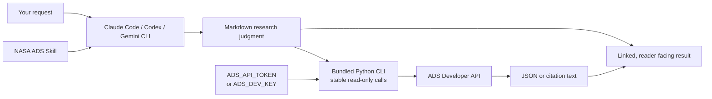

<h1 align="center">NASA ADS Skill</h1>

<div align="center">

**Markdown research judgment with a bundled Python API client**

Use the NASA Astrophysics Data System from Claude Code, Codex, Gemini CLI, or another Markdown-skill host.

[](https://ui.adsabs.harvard.edu/)
[](https://code.claude.com/docs/en/discover-plugins)
[](https://developers.openai.com/plugins/)
[](https://geminicli.com/docs/cli/gemini-md/)
[](plugins/nasa-ads/.codex-plugin/plugin.json)
[](LICENSE)
[](https://github.com/SukiYume/nasa-ads-skill)

[Overview](#overview) ·
[Agent install](#install-with-one-agent-prompt) ·
[Hosts](#supported-hosts) ·
[Install](#install) ·
[Configure the token](#configure-the-ads-token) ·
[Verify](#verify-the-api) ·
[Use it](#use-it) ·
[Troubleshooting](#troubleshooting) ·
[简体中文](README.zh-CN.md)

</div>

---

## Overview

NASA ADS Skill packages the public [NASA Astrophysics Data System Developer API](https://ui.adsabs.harvard.edu/help/api/) as a reusable workflow for Claude Code, Codex, Gemini CLI, and compatible Markdown-skill hosts. It can search astronomy and astrophysics literature, inspect publication metadata, export citations, work with ADS libraries, calculate bibliometric summaries, and discover related papers or full-text/data links.

The host sends requests directly from your computer to `https://api.adsabs.harvard.edu`. This repository stores no ADS token and runs no proxy service.

This README is the reader guide: install the project on a new computer, configure the token, verify the connection, and troubleshoot the host. [`SKILL.md`](plugins/nasa-ads/skills/nasa-ads/SKILL.md) is the agent runtime contract and intentionally does not repeat installation guidance.

Markdown handles query design, evidence assessment, safety confirmations, and synthesis. A bundled standard-library Python CLI handles stable read-only transport for search, batch lookup, citation export, metrics, citation suggestions, and resource resolution. The CLI rejects redirects and treats ADS error payloads as failed operations.

## Install with One Agent Prompt

If an agent with terminal and internet access is already running on the computer, copy the single sentence below into it. This is a natural-language prompt, not a shell command.

```text
Install the current NASA ADS Skill from https://github.com/SukiYume/nasa-ads-skill on this computer: read the repository README and SKILL.md completely, identify the agent host you are running in, install any missing documented prerequisites and the complete skill through that host's README instructions, replace only an existing nasa-ads installation if necessary, check ADS_API_TOKEN and then ADS_DEV_KEY without displaying either value and direct me to the documented token setup if both are absent, verify that SKILL.md and scripts/ads_api.py are installed, run ads_api.py --version, run the documented public-paper API smoke test when credentials are available, and report the installation path, version, and validation result.
```

## Supported Hosts

| Host | Integration | What becomes available |
|---|---|---|
| Claude Code | Marketplace plugin | Five namespaced slash commands plus natural-language skill activation |
| Codex CLI / desktop app | Marketplace plugin | Installable NASA ADS skill with UI metadata |
| Codex CLI / IDE extension | Standalone skill | `$nasa-ads` and automatic activation from matching requests |
| Gemini CLI | `GEMINI.md` import | Project or user-level NASA ADS instructions |
| Other assistants | Markdown skill folder | The shared `SKILL.md` workflow when the host supports reusable instructions and shell access |

## Capabilities

| Capability | Examples |
|---|---|
| Literature search | Author, title, abstract, full text, bibcode, DOI, arXiv ID, ORCID, year, journal, or target name |
| Claim checking | Search several formulations, inspect abstracts, and report the searched scope |
| Metadata | Title, authors, abstract, year, venue, DOI, identifiers, citation count, and read count |
| Citation export | BibTeX, BibTeX with abstracts, AASTeX, MNRAS, RIS, EndNote, IEEE, XML formats, and more |
| ADS libraries | List, view, create, update, share, combine, empty, and delete libraries |
| Bibliometrics | Basic statistics, citations, h-index, g-index, i10-index, histograms, and time series |
| Discovery | Suggested citations, similar/useful papers, publisher pages, arXiv, and data-archive links |

## How It Works



## Before You Install

Prepare these items on the new computer:

1. **Git**, available from [git-scm.com/downloads](https://git-scm.com/downloads).
2. **One supported host**:
   - [Claude Code setup](https://code.claude.com/docs/en/setup)
   - [Codex CLI setup](https://developers.openai.com/codex/cli/)
   - [Gemini CLI installation](https://geminicli.com/docs/get-started/installation/)
3. **An ADS account and API token**, created later in [Configure the ADS token](#configure-the-ads-token).
4. **One API transport**: Python 3.10 or newer is the recommended default and is available from [python.org/downloads](https://www.python.org/downloads/). The bundled CLI uses only the Python standard library. If Python is unavailable, use `curl` on macOS/Linux/WSL or PowerShell on Windows for the conditional direct HTTP fallback.
5. **Outbound HTTPS access** to `api.adsabs.harvard.edu`.

Check the installed commands:

```bash
git --version
python3 --version   # macOS, Linux, or WSL
python --version    # Windows; "py -3 --version" is also supported
claude --version   # when using Claude Code
codex --version    # when using Codex
gemini --version   # when using Gemini CLI
```

If a selected host command is missing, install or update that host from its official setup page before continuing.

## Install

Choose one host below. Claude Code and Codex can add the public GitHub repository directly as a marketplace. Standalone and Gemini installations keep a local source clone so they can be updated later.

### Claude Code Plugin

These commands work in macOS, Linux, Windows PowerShell, and Windows Command Prompt after Claude Code is installed.

1. Add the GitHub repository as a Claude Code marketplace:

```bash
claude plugin marketplace add SukiYume/nasa-ads-skill
```

2. Install the `nasa-ads` plugin from that marketplace:

```bash
claude plugin install nasa-ads@nasa-ads-community
```

3. Confirm the installation:

```bash
claude plugin list
```

Look for `nasa-ads@nasa-ads-community`.

4. Start Claude Code:

```bash
claude
```

Run `/reload-plugins` if the installation happened during an existing session. The plugin provides:

```text
/nasa-ads:ads-search <query>
/nasa-ads:ads-bibtex <bibcodes>
/nasa-ads:ads-library [subcommand]
/nasa-ads:ads-metrics <bibcodes>
/nasa-ads:ads-cite [subcommand]
```

Continue with [Configure the ADS token](#configure-the-ads-token), then run the public-paper test in [Verify the API](#verify-the-api).

### Codex Plugin

Codex plugins are available in Codex CLI and Codex in the desktop app. Use the standalone-skill path below for the IDE extension.

1. Add the GitHub repository as a Codex marketplace:

```bash
codex plugin marketplace add SukiYume/nasa-ads-skill
```

2. Install the plugin:

```bash
codex plugin add nasa-ads@nasa-ads-community
```

3. Confirm that Codex sees it:

```bash
codex plugin list
```

4. Start a new Codex session so the bundled skill enters the session’s skill catalog:

```bash
codex
```

Invoke it explicitly with `$nasa-ads`, open `/skills`, or describe an astronomy-literature task in plain language.

Continue with [Configure the ADS token](#configure-the-ads-token), then run the public-paper test in [Verify the API](#verify-the-api).

### Codex Standalone Skill

Codex currently discovers user-level standalone skills under `~/.agents/skills`. This path applies to Codex CLI and the IDE extension.

#### macOS, Linux, or WSL

Keep a source clone at a stable user-level path, then copy the skill contents into Codex’s discovery directory:

```bash
mkdir -p "$HOME/.local/share"
git clone --depth 1 \
  https://github.com/SukiYume/nasa-ads-skill.git \
  "$HOME/.local/share/nasa-ads-skill"
mkdir -p "$HOME/.agents/skills/nasa-ads"
cp -R \
  "$HOME/.local/share/nasa-ads-skill/plugins/nasa-ads/skills/nasa-ads/." \
  "$HOME/.agents/skills/nasa-ads/"
```

Verify the required file:

```bash
test -f "$HOME/.agents/skills/nasa-ads/SKILL.md" \
  && test -f "$HOME/.agents/skills/nasa-ads/scripts/ads_api.py" \
  && test -f "$HOME/.agents/skills/nasa-ads/references/http-fallback.md" \
  && test -f "$HOME/.agents/skills/nasa-ads/references/libraries.md" \
  && echo "NASA ADS skill installed"
```

#### Windows PowerShell

Keep a source clone at a stable user-level path, then copy the skill contents into Codex’s discovery directory:

```powershell
$nasaAdsSource = Join-Path $HOME 'nasa-ads-skill-source'
$nasaAdsSkill = Join-Path $HOME '.agents\skills\nasa-ads'
git clone --depth 1 `
  https://github.com/SukiYume/nasa-ads-skill.git `
  $nasaAdsSource
New-Item -ItemType Directory -Force $nasaAdsSkill | Out-Null
Copy-Item -Recurse -Force `
  (Join-Path $nasaAdsSource 'plugins\nasa-ads\skills\nasa-ads\*') `
  $nasaAdsSkill
```

Verify the required file:

```powershell
$nasaAdsSkillReady = `
  (Test-Path "$HOME\.agents\skills\nasa-ads\SKILL.md") -and `
  (Test-Path "$HOME\.agents\skills\nasa-ads\scripts\ads_api.py") -and `
  (Test-Path "$HOME\.agents\skills\nasa-ads\references\http-fallback.md") -and `
  (Test-Path "$HOME\.agents\skills\nasa-ads\references\libraries.md")
$nasaAdsSkillReady
```

A successful check returns `True`.

Start a new Codex session. Use `/skills` to inspect the catalog or type `$nasa-ads` in the prompt.

For a repository-only installation, copy the same `nasa-ads` skill folder to `<repository>/.agents/skills/nasa-ads`.

### Gemini CLI

Gemini CLI loads instruction files through `GEMINI.md`. The following user-level setup makes NASA ADS available in every Gemini CLI project.

#### macOS, Linux, or WSL

```bash
mkdir -p "$HOME/.gemini"
git clone --depth 1 \
  https://github.com/SukiYume/nasa-ads-skill.git \
  "$HOME/.gemini/nasa-ads-skill"
printf '\n@./nasa-ads-skill/plugins/nasa-ads/skills/nasa-ads/SKILL.md\n' \
  >> "$HOME/.gemini/GEMINI.md"
```

#### Windows PowerShell

```powershell
New-Item -ItemType Directory -Force "$HOME\.gemini" | Out-Null
git clone --depth 1 `
  https://github.com/SukiYume/nasa-ads-skill.git `
  "$HOME\.gemini\nasa-ads-skill"
Add-Content -Path "$HOME\.gemini\GEMINI.md" -Value `
  "`n@./nasa-ads-skill/plugins/nasa-ads/skills/nasa-ads/SKILL.md"
```

Start Gemini CLI:

```bash
gemini
```

Then run:

```text
/memory reload
/memory show
```

Confirm that the loaded memory contains the `NASA ADS` heading. The repository’s own [`GEMINI.md`](GEMINI.md) demonstrates the same relative-import format for a project-level setup.

### Generic Markdown-Skill Host

1. Clone the repository:

```bash
git clone https://github.com/SukiYume/nasa-ads-skill.git
```

2. Copy the complete `plugins/nasa-ads/skills/nasa-ads/` folder into the host’s documented skill or prompt directory.
3. Configure the host to load `SKILL.md`.
4. Confirm that the host can run the bundled CLI with Python 3, or can use `curl`/PowerShell for direct HTTP fallback.
5. Set the ADS token as described below.
6. Run the public-paper smoke test in [Verify the API](#verify-the-api).

The exact discovery directory and invocation syntax depend on the host. Consult that host’s current documentation when it does not use the Claude Code, Codex, or Gemini conventions above.

## Configure the ADS Token

Every ADS Developer API request requires a personal token.

1. Open [ADS token settings](https://ui.adsabs.harvard.edu/#user/settings/token).
2. Register for ADS or sign in.
3. Open account settings and select **API Token** if the direct link lands elsewhere.
4. Select **Generate a new key**.
5. Copy the token and keep it private.

Use `ADS_API_TOKEN` as the primary environment variable. `ADS_DEV_KEY` remains available as a compatibility fallback.

### macOS, Linux, or WSL

Set the token for the current terminal:

```bash
export ADS_API_TOKEN='paste-your-token-here'
```

This value lasts until that terminal closes. For persistent use, add the same `export` line to the startup file for your shell, commonly `~/.zshrc`, `~/.bashrc`, or `~/.bash_profile`, and open a new terminal.

Verify presence without printing the token:

```bash
if [ -n "${ADS_API_TOKEN:-${ADS_DEV_KEY:-}}" ]; then
  echo "ADS token is set"
else
  echo "ADS token is missing"
fi
```

### Windows PowerShell

Set the token for the current PowerShell session:

```powershell
$env:ADS_API_TOKEN = 'paste-your-token-here'
```

Set a persistent user environment variable:

```powershell
[Environment]::SetEnvironmentVariable(
  'ADS_API_TOKEN',
  'paste-your-token-here',
  'User'
)
```

Open a new terminal and restart the host after the persistent command. Verify presence without printing the token:

```powershell
if ($env:ADS_API_TOKEN -or $env:ADS_DEV_KEY) {
  'ADS token is set'
} else {
  'ADS token is missing'
}
```

Keep the token out of repositories, screenshots, shared logs, shell transcripts, and support messages. Revoke and regenerate it from ADS settings if exposure occurs.

## Verify the API

Use a known public paper to verify network access, authentication, and the ADS response shape.

### Installed host

Restart the host after setting a persistent token. In Claude Code, run:

```text
/nasa-ads:ads-search bibcode:2016PhRvL.116f1102A
```

In Codex, Gemini CLI, or another host, send:

```text
Search NASA ADS for bibcode 2016PhRvL.116f1102A and return its title, year, and bibcode.
```

The result should identify *Observation of Gravitational Waves from a Binary Black Hole Merger* and include `2016PhRvL.116f1102A`. A missing-token message means the environment variable was not inherited by the host; an HTTP error should be handled with [Troubleshooting](#troubleshooting).

### Bundled Python CLI

Standalone Codex and Gemini installations created a source checkout at a path shown below. Move into the matching directory before running the CLI.

On macOS, Linux, or WSL:

```bash
cd "$HOME/.local/share/nasa-ads-skill"  # standalone Codex
# For Gemini CLI instead:
# cd "$HOME/.gemini/nasa-ads-skill"
```

Then run:

```bash
python3 plugins/nasa-ads/skills/nasa-ads/scripts/ads_api.py search \
  --query 'bibcode:2016PhRvL.116f1102A' \
  --fields bibcode,title,year \
  --rows 1
```

On Windows PowerShell:

```powershell
Set-Location "$HOME\nasa-ads-skill-source"  # standalone Codex
# For Gemini CLI instead:
# Set-Location "$HOME\.gemini\nasa-ads-skill"
```

Then run:

```powershell
python plugins\nasa-ads\skills\nasa-ads\scripts\ads_api.py search `
  --query 'bibcode:2016PhRvL.116f1102A' `
  --fields 'bibcode,title,year' `
  --rows 1
```

Use `py -3` in place of `python` when that is how Python is registered. If you cloned the repository to another location, enter that checkout instead. The JSON response should contain the bibcode `2016PhRvL.116f1102A`.

### Direct HTTP fallback

Use this only when Python 3 cannot run the bundled CLI or an endpoint is not exposed by it. Follow the credential preflight, redirect rule, response checks, and platform-specific example in [`references/http-fallback.md`](plugins/nasa-ads/skills/nasa-ads/references/http-fallback.md).

## Use It

Natural-language requests work in every supported host:

- “Search ADS for recent refereed papers on exoplanet atmospheres.”
- “Check whether this claim has been mentioned in astronomy literature, and show your search terms.”
- “Get the BibTeX for `2016PhRvL.116f1102A`.”
- “List my ADS libraries.”
- “Show citation metrics for these bibcodes.”
- “Find papers similar to `2016PhRvL.116f1102A`.”
- “检索 2022 年以来关于快速射电暴重复暴的论文，并按主题总结。”
- “查一下这个说法有没有天文文献提到，说明检索范围。”

Claude Code command examples:

```text
/nasa-ads:ads-search dark matter year:2020-2024
/nasa-ads:ads-bibtex 2016PhRvL.116f1102A 2017ApJ...848L..12A --format aastex
/nasa-ads:ads-library create "My Reading List"
/nasa-ads:ads-metrics 2016PhRvL.116f1102A
/nasa-ads:ads-cite links 2016PhRvL.116f1102A
```

The skill instructs the agent to return linked, readable results; refine weak literature searches; and label empty searches by their actual query scope.

## Troubleshooting

| Symptom | Check |
|---|---|
| `git`, `claude`, `codex`, or `gemini` is unknown | Install or update the selected program from the official link in [Before You Install](#before-you-install) |
| Claude marketplace or plugin is missing | Run `claude plugin marketplace update nasa-ads-community`, reinstall if needed, then run `/reload-plugins` |
| Codex marketplace or plugin is missing | Run `codex plugin marketplace upgrade nasa-ads-community`, run `codex plugin add nasa-ads@nasa-ads-community`, and start a new session |
| Codex standalone skill is absent from `/skills` | Confirm `~/.agents/skills/nasa-ads/SKILL.md` exists and start a new session |
| Gemini does not load the instructions | Check the relative path in `~/.gemini/GEMINI.md`, then run `/memory reload` and `/memory show` |
| Python CLI cannot start | Install Python 3.10 or newer, try `python3`, `python`, or `py -3`, and confirm the complete skill folder includes `scripts/ads_api.py` |
| `401 Unauthorized` | Set a current token, open a new terminal, and verify the `Bearer` header path through the smoke test |
| `403 Forbidden` | Check ADS account access and library permissions |
| `429 Too Many Requests` | Read the `X-RateLimit-Remaining` and `X-RateLimit-Reset` response headers |
| Unexpected API redirect | Stop and update the installed skill or endpoint; never follow an authenticated redirect |
| ADS application error with HTTP `200` | Treat the operation as failed and report the returned error detail |
| Search returns no papers | Remove unnecessary filters, try synonyms and spelling variants, and record the query scope |
| Query breaks around `&` or spaces | Use the bundled CLI, which URL-encodes parameters; direct HTTP fallbacks must encode `q`, `fq`, and `sort` |

## Updating an Existing Install

For a Claude Code or Codex plugin, refresh the marketplace and installed plugin:

```bash
claude plugin marketplace update nasa-ads-community
claude plugin update nasa-ads@nasa-ads-community
```

```bash
codex plugin marketplace upgrade nasa-ads-community
codex plugin add nasa-ads@nasa-ads-community
```

For a standalone skill or Gemini CLI import, update the source path chosen during installation. The commands below use the paths shown in this README.

For a standalone Codex skill on macOS, Linux, or WSL:

```bash
git -C "$HOME/.local/share/nasa-ads-skill" pull --ff-only
cp -R \
  "$HOME/.local/share/nasa-ads-skill/plugins/nasa-ads/skills/nasa-ads/." \
  "$HOME/.agents/skills/nasa-ads/"
```

For a standalone Codex skill on Windows PowerShell:

```powershell
$nasaAdsSource = Join-Path $HOME 'nasa-ads-skill-source'
$nasaAdsSkill = Join-Path $HOME '.agents\skills\nasa-ads'
git -C $nasaAdsSource pull --ff-only
Copy-Item -Recurse -Force `
  (Join-Path $nasaAdsSource 'plugins\nasa-ads\skills\nasa-ads\*') `
  $nasaAdsSkill
```

For Gemini CLI on macOS, Linux, or WSL:

```bash
git -C "$HOME/.gemini/nasa-ads-skill" pull --ff-only
```

For Gemini CLI on Windows PowerShell:

```powershell
git -C "$HOME\.gemini\nasa-ads-skill" pull --ff-only
```

Run `/memory reload` in Gemini CLI after updating. Start a new Codex or Claude Code session after updating those hosts.

## Security

- Review this public repository before installation.
- Keep `ADS_API_TOKEN` and `ADS_DEV_KEY` outside tracked files.
- Never follow redirects for authenticated ADS API requests.
- Confirm destructive ADS library actions, note replacement or deletion, permission changes, and ownership transfer.
- Treat publisher and data-archive links as external destinations.
- ADS rate limits are endpoint-specific; response headers are the live authority.

## References

- [ADS API overview](https://ui.adsabs.harvard.edu/help/api/)
- [ADS OpenAPI documentation](https://ui.adsabs.harvard.edu/help/api/api-docs.html)
- [ADS Developer API examples](https://github.com/adsabs/adsabs-dev-api)
- [Claude Code plugin installation](https://code.claude.com/docs/en/discover-plugins)
- [OpenAI plugin documentation](https://developers.openai.com/plugins/)
- [Gemini CLI `GEMINI.md` documentation](https://geminicli.com/docs/cli/gemini-md/)

## License

[MIT](LICENSE)

---

<div align="center">

NASA ADS Skill · From a fresh machine to a verified literature search

</div>
