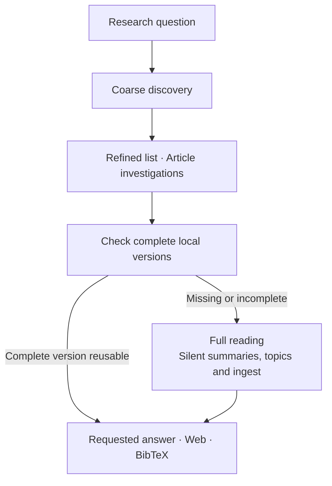

<h1 align="center">NASA ADS Skill</h1>

<div align="center">

**Astronomy research with a reusable personal literature library**

Literature reviews · Manuscript evidence · Local Web · BibTeX

[](https://ui.adsabs.harvard.edu/)
[](plugins/nasa-ads/.codex-plugin/plugin.json)
[](https://www.python.org/)
[](#open-the-web-library)
[](LICENSE)
[](https://github.com/SukiYume/nasa-ads-skill)

[Overview](#overview) ·
[Install](#install-with-one-agent-prompt) ·
[Research and writing](#use-it) ·
[Web library](#open-the-web-library) ·
[Your library](#personal-literature-library) ·
[Help](#troubleshooting) ·
[简体中文](README.zh-CN.md)

</div>

---

## Overview

**NASA ADS Skill** brings [NASA ADS](https://ui.adsabs.harvard.edu/) into Claude Code, Codex, Gemini CLI, and other Markdown-skill hosts. It supports astronomy literature discovery, claim checks, and evidence gathering for **reviews, introductions, methods, and discussions**.

Each research task builds knowledge for later use:

- **Summarize and organize**: research silently builds your library through authored summaries, hierarchical topics, and persistent storage.
- **Read and verify**: content investigations produce complete article digests with evidence locations and reading coverage.
- **Reuse and cite**: later tasks reuse stored knowledge; the personal library supports local Web browsing and BibTeX export.

## Install with One Agent Prompt

Paste the prompt below into an agent with terminal and internet access. It selects the instructions for your host and checks the complete installation.

<details>
<summary><strong>Copy the installation prompt</strong> · The agent completes setup and verification</summary>

```text
Install the current NASA ADS Skill from https://github.com/SukiYume/nasa-ads-skill on this computer: read the README and follow docs/installation.md for the current agent host, install missing prerequisites and the complete skill, replace only an existing nasa-ads installation when needed, check ADS_API_TOKEN and then ADS_DEV_KEY without displaying their values and guide me through token setup for online ADS access when both are absent, verify SKILL.md, agents/openai.yaml, scripts/ads_api.py, scripts/fulltext.py, scripts/literature_db.py, scripts/library_catalog.py, scripts/library_web.py, scripts/adslib.py, assets/library/index.html, assets/library/style.css, assets/library/app.js, references/research-writing.md, references/ads-cli.md, references/fulltext.md, references/literature-memory.md, references/digest-schema.md, references/libraries.md, and references/http-fallback.md, read the installed SKILL.md, run all four CLI version checks, run install from the installed scripts/adslib.py to register the adslib command and verify adslib --version in a fresh terminal, run the documented API smoke test when credentials are available, run the full-text and library smoke tests with the documented diagnostic options, verify that the Web page loads, and report the installed path, version, and results.
```

</details>

## Install

Prepare [Git](https://git-scm.com/downloads/), a supported agent host, and [Python 3.10 or newer](https://www.python.org/downloads/). The complete library and Web workflow uses Python; its core functions use the standard library. Optional PDF helpers improve extraction and page rendering. [Prerequisites and helper details](docs/installation.md#before-you-install).

Choose the route matching your host:

| Your host | Installation instructions | How to use the skill |
| --- | --- | --- |
| **Claude Code** | [Marketplace plugin](docs/installation.md#claude-code-plugin) | Natural language or `/nasa-ads:ads-search` |
| **Codex CLI / desktop app** | [Marketplace plugin](docs/installation.md#codex-plugin) | Natural language or `$nasa-ads` |
| **Codex CLI / IDE extension** | [Standalone skill](docs/installation.md#codex-standalone-skill) | Install under `~/.agents/skills/nasa-ads`, then start a new session |
| **Gemini CLI** | [`GEMINI.md` import](docs/installation.md#gemini-cli) | Natural-language requests after loading the instructions |
| **Other assistants** | [Complete Markdown skill folder](docs/installation.md#generic-markdown-skill-host) | Use the host's skill-loading method |

The [installation guide](docs/installation.md) contains Windows and macOS/Linux/WSL commands, all required-file checks, and diagnostics. Existing installations use the [update instructions](docs/installation.md#updating-an-existing-install). Keep the complete skill folder so its scripts, references, and Web assets remain available.

## Configure the ADS Token

Online ADS requests require a personal token from [ADS account settings](https://ui.adsabs.harvard.edu/#user/settings/token). Use `ADS_API_TOKEN`; `ADS_DEV_KEY` is supported as a fallback. Local library browsing, stored article reading, and cached citations work offline.

Set the token in the terminal that will start your agent. These examples report presence without printing the value.

**Windows PowerShell:**

```powershell
$env:ADS_API_TOKEN = 'paste-your-token-here'
if ($env:ADS_API_TOKEN -or $env:ADS_DEV_KEY) { 'ADS token is set' }
```

**macOS, Linux, or WSL:**

```bash
export ADS_API_TOKEN='paste-your-token-here'
if [ -n "${ADS_API_TOKEN:-${ADS_DEV_KEY:-}}" ]; then echo "ADS token is set"; fi
```

These settings last for the current terminal. Follow the [persistent token setup](docs/installation.md#configure-the-ads-token) for future sessions, then reopen the terminal and agent. Keep credentials outside shared files and logs. A [direct HTTP fallback](plugins/nasa-ads/skills/nasa-ads/references/http-fallback.md) covers supported remote API operations when Python is unavailable; full-text preparation, persistent storage, and Web browsing require Python.

## Verify the API

After installation, send your agent a small request:

> Use nasa-ads to find bibcode 2016PhRvL.116f1102A and return its title, year, and ADS link.

The result should identify *Observation of Gravitational Waves from a Binary Black Hole Merger* (2016). The [verification guide](docs/installation.md#verify-the-api) also provides CLI diagnostics that keep test papers out of your personal library, full-text checks, and expected version output.

## Use It

Describe the scientific question and the kind of evidence you need. The skill handles local reuse, new discovery, reading, summaries, and classification within that task.

| What you need | Example request |
| --- | --- |
| **A literature review** | “Review repeating-FRB research since 2022, organize it by scientific question, and explain disagreements and gaps.” |
| **Introduction evidence** | “Find foundational and recent primary papers for this introduction, and connect each planned claim to its evidence.” |
| **Methods evidence** | “Find the original method and validation studies for this periodicity test; compare assumptions, trial factors, and limits.” |
| **Discussion evidence** | “Find studies that support or challenge this interpretation, and compare sample selection and uncertainties.” |
| **A specific article** | “Read arXiv:1901.04502 and summarize its methods, findings, and limitations.” |
| **An article detail** | “Explain Figure 3 in this paper and check the authors’ conclusion.” |
| **Earlier reading** | “Search my local library for circular-polarization sign reversals and show the supporting findings.” |
| **Citations** | “Export BibTeX for these papers using cached official ADS entries where available.” |
| **ADS account tools** | “List my ADS libraries” or “Show citation metrics for these bibcodes.” |

Describe the research question; storage is part of the default workflow. Coarse discovery organizes candidate records and source briefs. Every paper selected for content assessment enters the refined reading set and receives full reading and silent ingest, including papers later excluded from the synthesis. A question about one figure, table, or conclusion follows the same paper-wide workflow; the answer addresses the requested detail. Verified complete versions are reused, and adequate local evidence can support an offline review. Successful library work stays silent. Access gaps are reported; a persistent storage failure preserves retry materials and is disclosed alongside the verified scientific answer.

## Open the Web Library

After [registering adslib during installation](docs/installation.md#register-the-adslib-command), run this from any directory:

```bash
adslib
```

`adslib` opens the browser and starts or reuses a background service. You can close the terminal. Run it again after restarting the computer. A conflicting port gets an available alternative; subsequent commands discover that service using the same library and preferred port. Web uses local assets and the Python standard library and needs no ADS token.

| Command | Action |
| --- | --- |
| `adslib` / `adslib open` | Open the library; start it in the background when needed |
| `adslib start` | Start in the background without opening a browser |
| `adslib status` | Show the URL, library directory, version and process ID |
| `adslib stop` | Stop the service gracefully |
| `adslib restart` | Restart in the background |
| `adslib serve` | Run in the foreground; stop with `Ctrl+C` |
| `adslib --help` / `adslib --version` | Show help or version |

Use `--library-dir "<directory>"` and `--port 8766` to select a service, for example `adslib stop --port 8766`. Options work before or after the service subcommand. `--no-open` suppresses browser launch. Closing the browser leaves the service running.

<details>
<summary><strong>Existing installation: register the command once</strong> · These examples use the Codex standalone path</summary>

**Windows PowerShell:**

```powershell
python "$HOME\.agents\skills\nasa-ads\scripts\adslib.py" install
```

**macOS, Linux, or WSL:**

```bash
python3 "$HOME/.agents/skills/nasa-ads/scripts/adslib.py" install
```

Open a new terminal and run `adslib`. Claude and marketplace plugins use their actual installed directory; see the [installation guide](docs/installation.md#register-the-adslib-command).

</details>

You can also ask the agent:

> Use the installed nasa-ads skill to open my personal Web library.

The page combines topics, writing roles, years, and search scopes; displays summaries and scientific findings; downloads saved article versions; and exports selected papers or the full filtered bibliography. Page links preserve the search and reading context. The agent updates classifications, summaries, and notes.

Other installation paths, keyboard controls, and custom data locations are covered in the [Web and library guide](docs/library.md#start-the-web-library).

## Personal Literature Library

The library belongs to the current computer. Installing the skill supplies its code and Web assets. Your accumulated papers and summaries live separately, and a new computer initially shows an empty library.



### Storage and Reuse

| Platform | Default library directory |
| --- | --- |
| Windows | `%LOCALAPPDATA%\nasa-ads\literature` |
| macOS / Linux / WSL | `${XDG_DATA_HOME:-~/.local/share}/nasa-ads/literature` |

Set `NASA_ADS_LITERATURE_DIR` to use another location. Literature tasks and the Web server must use the same directory. The Web page's library information button shows the active path and counts. One paper can have several exact versions, so the paper count and full-text-summary count can differ.

Scientific topics form a hierarchy, such as `FRB/Propagation/Scattering`. A paper can belong to multiple topics and writing roles: review, introduction, methods, discussion, and comparison. Tags and personal notes support later retrieval. A topic can also have a short thematic summary.

### Reading Levels

| Reading level | What the saved knowledge supports |
| --- | --- |
| **Metadata** | Identification and relevance from the available bibliographic record |
| **Abstract** | A source-based summary of the available abstract |
| **Complete / visual reading** | Detailed findings from an exact article version, with evidence locations and reading coverage |

Coarse metadata and abstract records retain their evidence levels. Refined candidates and specifically investigated papers require complete reading; existing metadata, abstracts, or downloads still need a full digest. The agent reads and preserves all scientific dimensions of the paper. Later tasks reuse verified complete versions. Unavailable full text remains an explicit reading gap.

> **Continue on another computer:** create a backup, transfer it, and restore it to a new directory. The [library guide](docs/library.md) covers [citation export](docs/library.md#export-citations), [backup and migration](docs/library.md#move-to-a-new-computer), [older database upgrades](docs/library.md#upgrade-an-older-library), and [health checks](docs/library.md#check-library-health).

## Troubleshooting

| Symptom | Next step |
| --- | --- |
| The host cannot find the skill | Follow its [installation and verification steps](docs/installation.md#install), then start a new host session |
| Python does not start | Install Python 3.10 or newer; try `python3`, `python`, or Windows `py -3` |
| ADS returns `401` | Check token presence and restart the host after setting its environment |
| ADS returns `403` or `429` | Check account/library permissions for `403`; respect the reported rate-limit reset for `429` |
| The `adslib` command is missing | Complete [one-time registration](docs/installation.md#register-the-adslib-command), then open a new terminal; restart an older terminal app or IDE if needed |
| The Web page cannot connect | Run `adslib`, keep its new service running, and open the exact printed URL |
| The Web page shows an unexpected count or an empty library | Check the displayed library path, active filters, and [data migration](docs/library.md#move-to-a-new-computer) |
| Papers are marked pending or unclassified | Ask the agent to finish the relevant summaries and scientific topic assignments |
| An older database reports a schema mismatch | Follow the [backup and upgrade procedure](docs/library.md#upgrade-an-older-library) |
| Full text is unavailable | The result retains available metadata or abstract evidence and reports the access gap |
| A local search misses a phrase | Search the stored full text; [search scopes and health checks](docs/library.md#check-library-health) help identify the cause |

## Data and Further Reading

ADS credentials are used for ADS requests. Article files come from lawful publisher, repository, arXiv, or ADS sources. Papers, summaries, and citation caches are stored locally; the selected agent host processes the content read for your task under that host's policies.

- [Installation, diagnostics, and updates](docs/installation.md)
- [Web browsing, citations, backup, and migration](docs/library.md)
- [Agent workflow](plugins/nasa-ads/skills/nasa-ads/SKILL.md) and [CLI reference](plugins/nasa-ads/skills/nasa-ads/references/ads-cli.md)
- [ADS API documentation](https://ui.adsabs.harvard.edu/help/api/) and [ADS Libraries](plugins/nasa-ads/skills/nasa-ads/references/libraries.md)
- [Project review and validation records](docs/review.md)

## License

[MIT](LICENSE)

---

<p align="center">
  <sub>NASA ADS Skill · Astronomy research, preserved for the next question.</sub>
</p>
