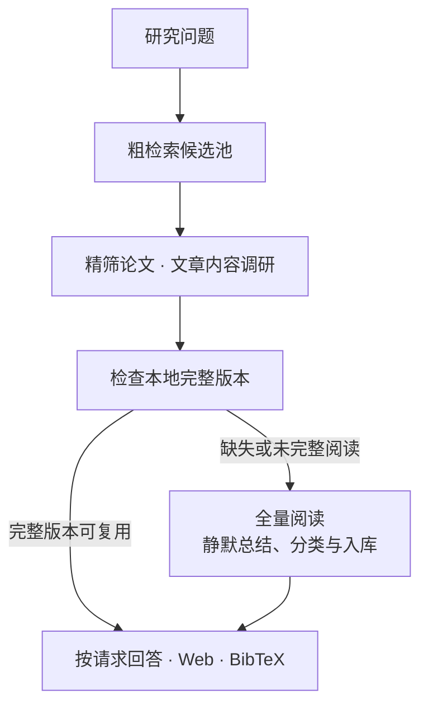

<h1 align="center">NASA ADS Skill</h1>

<div align="center">

**用于天文文献调研、论文写作与个人知识积累**

文献综述 · 写作证据 · 本地 Web · BibTeX

[](https://ui.adsabs.harvard.edu/)
[](plugins/nasa-ads/.codex-plugin/plugin.json)
[](https://www.python.org/)
[](#打开-web-文献库)
[](LICENSE)
[](https://github.com/SukiYume/nasa-ads-skill)

[项目概览](#项目概览) ·
[快速安装](#一句话交给-agent-安装) ·
[调研与写作](#开始使用) ·
[Web 文献库](#打开-web-文献库) ·
[个人文献库](#个人文献库) ·
[排错](#排错) ·
[English](README.md)

</div>

---

## 项目概览

**NASA ADS Skill** 将 [NASA ADS](https://ui.adsabs.harvard.edu/) 接入 Claude Code、Codex、Gemini CLI 及其他 Markdown skill 宿主，用于检索天文文献、核查论断，为**综述以及论文的引言、方法和讨论**寻找证据。

每次调研都为后续工作积累知识：

- **总结与分类**：文献调研默认静默积累个人文献库，Agent 完成总结、层级分类和保存。
- **阅读与核查**：内容调研形成完整文章总结，保留证据位置与阅读覆盖。
- **复用与引用**：后续任务复用已存知识，个人文献库支持本地 Web 浏览和 BibTeX 导出。

## 一句话交给 Agent 安装

将下面的提示词粘贴给可以使用终端和网络的 Agent。它会选择当前宿主对应的安装说明，并检查安装是否完整。

<details>
<summary><strong>展开并复制安装提示词</strong> · 由 Agent 完成安装与验证</summary>

```text
请在这台电脑上从 https://github.com/SukiYume/nasa-ads-skill 安装当前 NASA ADS Skill：阅读 README，按 docs/installation.zh-CN.md 中当前 Agent 宿主对应的步骤安装缺少的前置条件和完整 skill，需要替换时仅更新已有的 nasa-ads；依次检查 ADS_API_TOKEN 和 ADS_DEV_KEY 且不显示其值，两者都不存在时引导我配置在线 ADS 请求所需的 token；确认 SKILL.md、agents/openai.yaml、scripts/ads_api.py、scripts/fulltext.py、scripts/literature_db.py、scripts/library_catalog.py、scripts/library_web.py、scripts/adslib.py、assets/library/index.html、assets/library/style.css、assets/library/app.js、references/research-writing.md、references/ads-cli.md、references/fulltext.md、references/literature-memory.md、references/digest-schema.md、references/libraries.md 和 references/http-fallback.md 均已安装，阅读已安装的 SKILL.md，分别检查四个 CLI 的版本，从已安装的 scripts/adslib.py 执行 install 注册 adslib 命令并在新终端验证 adslib --version，凭据可用时执行文档中的 API smoke test，使用文档中的诊断选项完成全文与文献库 smoke test，确认 Web 页面能打开，并报告安装路径、版本与验证结果。
```

</details>

## 安装

准备 [Git](https://git-scm.com/downloads/)、一个支持的 Agent 宿主，以及 [Python 3.10 或更新版本](https://www.python.org/downloads/)。完整文献库与 Web 功能需要 Python，核心功能使用标准库。可选 PDF 工具能改善文本抽取与页面渲染。[前置条件和可选工具说明](docs/installation.zh-CN.md#安装前准备)。

按你正在使用的宿主选择安装入口：

| 当前宿主 | 安装说明 | 安装后如何调用 |
| --- | --- | --- |
| **Claude Code** | [Marketplace 插件](docs/installation.zh-CN.md#claude-code-plugin) | 自然语言或 `/nasa-ads:ads-search` |
| **Codex CLI / 桌面应用** | [Marketplace 插件](docs/installation.zh-CN.md#codex-plugin) | 自然语言或 `$nasa-ads` |
| **Codex CLI / IDE 扩展** | [独立 skill](docs/installation.zh-CN.md#codex-独立-skill) | 安装到 `~/.agents/skills/nasa-ads`，然后新建会话 |
| **Gemini CLI** | [`GEMINI.md` 导入](docs/installation.zh-CN.md#gemini-cli) | 加载指令后使用自然语言 |
| **其他助手** | [完整 Markdown skill 目录](docs/installation.zh-CN.md#通用-markdown-skill-宿主) | 使用宿主提供的 skill 加载方式 |

[安装指南](docs/installation.zh-CN.md)提供 Windows 和 macOS/Linux/WSL 命令、完整文件检查与诊断步骤。已经安装的用户可以直接查看[更新说明](docs/installation.zh-CN.md#更新已有安装)。保留完整 skill 目录，确保脚本、参考说明和 Web 资源都可用。

## 配置 ADS Token

在线 ADS 请求需要从 [ADS 账号设置](https://ui.adsabs.harvard.edu/#user/settings/token)获取个人 token。优先使用 `ADS_API_TOKEN`，兼容变量为 `ADS_DEV_KEY`。本地文献库浏览、已存文章阅读和缓存引用可以离线使用。

在准备启动 Agent 的终端中设置 token。下面的检查只报告是否已设置。

**Windows PowerShell：**

```powershell
$env:ADS_API_TOKEN = 'paste-your-token-here'
if ($env:ADS_API_TOKEN -or $env:ADS_DEV_KEY) { 'ADS token is set' }
```

**macOS、Linux 或 WSL：**

```bash
export ADS_API_TOKEN='paste-your-token-here'
if [ -n "${ADS_API_TOKEN:-${ADS_DEV_KEY:-}}" ]; then echo "ADS token is set"; fi
```

这些设置在当前终端内生效。需要在后续会话继续使用时，按[持久配置说明](docs/installation.zh-CN.md#配置-ads-token)操作，再重新打开终端和 Agent。凭据应保存在共享文件和日志之外。Python 暂时不可用时，[直接 HTTP 回退](plugins/nasa-ads/skills/nasa-ads/references/http-fallback.md)可以完成受支持的远程 API 操作；全文准备、持久存储和 Web 浏览需要 Python。

## 验证 API

安装后，可以先向 Agent 发出一个简单请求：

> 使用 nasa-ads 检索 bibcode 2016PhRvL.116f1102A，返回标题、年份和 ADS 链接。

结果应包含 *Observation of Gravitational Waves from a Binary Black Hole Merger*（2016）。[验证指南](docs/installation.zh-CN.md#验证-api)还提供了保持个人文献库原有内容的 CLI 诊断、全文检查，以及预期版本输出。

## 开始使用

说明科学问题和所需证据即可。Skill 会在这个任务中完成本地复用、新文献发现、阅读、总结与分类。

| 你要完成的事情 | 请求示例 |
| --- | --- |
| **文献综述** | “综述 2022 年以来的重复 FRB 研究，按科学问题组织，说明分歧与研究空白。” |
| **引言证据** | “为这段引言寻找奠基性和近期原始论文，逐条对应计划写出的论断。” |
| **方法依据** | “查找这个周期检验的原始方法和验证研究，比较假设、试验因子及适用限制。” |
| **讨论证据** | “查找支持或挑战这个解释的研究，比较样本选择与不确定性。” |
| **阅读指定文章** | “阅读 arXiv:1901.04502，总结方法、发现与局限。” |
| **核查文章细节** | “解释这篇论文图 3 的结果，并核对作者的结论。” |
| **复用已有阅读** | “在本地文献库中查找圆偏振符号反转，给出相关结论和证据位置。” |
| **导出引用** | “导出这些论文的 BibTeX，优先使用缓存的 ADS 官方条目。” |
| **ADS 账号工具** | “列出我的 ADS libraries”，或“查看这些 bibcode 的引用指标。” |

直接说明研究问题即可，入库属于默认流程。粗检索整理候选题录与来源简述；选入内容评估的每篇论文进入精筛阅读集合，全部完成全文阅读与静默入库，包括后来未被最终综述采用的论文。查看一张图、一个表或某项结论也执行同样的整篇阅读流程，答复聚焦所问细节。已核验的完整版本会直接复用，本地证据充足时也可以离线完成综述。正常入库保持静默；访问缺口会明确说明，持续保存失败时会保留重试材料，并随已核实的科学答复说明入库缺口。

## 打开 Web 文献库

完成安装中的 [adslib 命令注册](docs/installation.zh-CN.md#注册-adslib-命令)后，在任意目录执行：

```bash
adslib
```

`adslib` 自动打开浏览器，并启动或复用后台服务。可以直接关闭终端，重启电脑后再次执行即可。端口冲突时自动选择可用端口，后续命令根据相同的文献库和优先端口找到该服务。Web 使用本地资源和 Python 标准库，无需 ADS token。

| 命令 | 功能 |
| --- | --- |
| `adslib` / `adslib open` | 打开文献库，按需在后台启动服务 |
| `adslib start` | 后台启动服务，保持浏览器状态 |
| `adslib status` | 查看地址、文献库目录、版本和进程号 |
| `adslib stop` | 正常停止服务 |
| `adslib restart` | 在后台重启服务 |
| `adslib serve` | 前台运行，按 `Ctrl+C` 停止 |
| `adslib --help` / `adslib --version` | 查看帮助或版本 |

使用 `--library-dir "<目录>"` 和 `--port 8766` 选择服务，例如 `adslib stop --port 8766`。参数可放在服务子命令前后。`--no-open` 用于关闭自动打开浏览器的行为。关闭浏览器后服务继续运行。

<details>
<summary><strong>已有安装：补做一次命令注册</strong> · 以下使用 Codex 独立 skill 路径</summary>

**Windows PowerShell：**

```powershell
python "$HOME\.agents\skills\nasa-ads\scripts\adslib.py" install
```

**macOS、Linux 或 WSL：**

```bash
python3 "$HOME/.agents/skills/nasa-ads/scripts/adslib.py" install
```

完成后新开终端，运行 `adslib`。Claude 与 marketplace 插件使用实际安装目录，详见[安装指南](docs/installation.zh-CN.md#注册-adslib-命令)。

</details>

也可以直接对 Agent 说：

> 使用已安装的 nasa-ads skill 打开我的个人 Web 文献库。

页面支持组合主题、写作用途、年份和检索范围，阅读总结与科学发现，下载已存文章版本，并导出勾选论文或整组筛选结果的引用。页面链接保留检索与阅读位置。分类、总结和笔记由 Agent 更新。

其他安装位置、键盘操作和自定义数据目录见 [Web 与文献库指南](docs/library.zh-CN.md#启动-web)。

## 个人文献库

文献库保存在当前电脑。安装 skill 会获得程序和 Web 资源，个人积累的论文与总结保存在独立目录中。新电脑最初会显示空库。



### 存储与复用

| 平台 | 默认文献库目录 |
| --- | --- |
| Windows | `%LOCALAPPDATA%\nasa-ads\literature` |
| macOS / Linux / WSL | `${XDG_DATA_HOME:-~/.local/share}/nasa-ads/literature` |

可以通过 `NASA_ADS_LITERATURE_DIR` 选择其他位置。文献任务与 Web 服务需要使用同一目录。页面中的文献库信息按钮会显示实际路径和数量。同一篇文章可以保存多个精确版本，因此文章数与全文总结数可能不同。

科学主题使用层级目录，例如 `快速射电暴/传播效应/散射`。一篇文章可以同时属于多个主题，并用于综述、引言、方法、讨论和结果比较。标签与个人笔记用于后续查找，分类目录也可以保存简短的主题综述。

### 阅读层级

| 阅读层级 | 已存知识能够支持的内容 |
| --- | --- |
| **题录记录** | 根据现有书目信息识别文章、判断相关性 |
| **摘要记录** | 根据来源摘要撰写的总结 |
| **完整阅读 / 视觉阅读** | 精确文章版本中的详细结论、证据位置与阅读覆盖 |

粗检索的题录和摘要保留各自的证据层级。进入精筛或指定内容调研的论文需要完整阅读，已有题录、摘要或下载文件仍需补齐全文总结。Agent 负责阅读并保存文章的全部科学维度，后续任务优先复用核验过的完整版本。全文无法取得时会保留明确的阅读缺口。

> **在新电脑继续使用：** 先创建备份、转移备份目录，再恢复到新位置。[文献库指南](docs/library.zh-CN.md)提供[引用导出](docs/library.zh-CN.md#导出引用)、[备份与迁移](docs/library.zh-CN.md#迁移到新电脑)、[旧库升级](docs/library.zh-CN.md#升级旧版文献库)和[健康检查](docs/library.zh-CN.md#检查文献库状态)步骤。

## 排错

| 现象 | 下一步 |
| --- | --- |
| 宿主找不到 skill | 按对应宿主的[安装与验证步骤](docs/installation.zh-CN.md#安装)检查，再新建会话 |
| Python 无法启动 | 安装 Python 3.10 或更新版本，尝试 `python3`、`python` 或 Windows 的 `py -3` |
| ADS 返回 `401` | 检查 token 是否已设置，更新环境变量后重启宿主 |
| ADS 返回 `403` 或 `429` | `403` 检查账号和 library 权限；`429` 按返回的限流恢复时间重试 |
| 找不到 `adslib` 命令 | 完成[一次性注册](docs/installation.zh-CN.md#注册-adslib-命令)，然后新开终端；旧终端或 IDE 可重启后再试 |
| Web 页面连接失败 | 运行 `adslib`，保持新启动的服务运行，并打开它输出的准确地址 |
| Web 数量不符合预期或显示空库 | 核对页面显示的目录、当前筛选和[数据迁移](docs/library.zh-CN.md#迁移到新电脑)情况 |
| 论文显示待总结或待分类 | 让 Agent 完成相关来源总结与科学主题分类 |
| 旧数据库报告 schema 不匹配 | 按[备份与升级步骤](docs/library.zh-CN.md#升级旧版文献库)处理 |
| 全文暂时无法获取 | 保留现有题录或摘要证据，并在结果中说明访问缺口 |
| 本地检索找不到原句 | 改为搜索已存全文，并参考[检索范围与状态检查](docs/library.zh-CN.md#检查文献库状态) |

## 数据与进一步阅读

ADS 凭据用于 ADS 请求。文章文件来自合法可访问的出版社、仓储、arXiv 或 ADS 来源。论文、总结和引用缓存保存在本地；所选 Agent 宿主会按自身的数据政策处理任务中读取的内容。

- [安装、诊断与更新](docs/installation.zh-CN.md)
- [Web、引用、备份与迁移](docs/library.zh-CN.md)
- [Agent 工作流](plugins/nasa-ads/skills/nasa-ads/SKILL.md)与 [CLI 参考](plugins/nasa-ads/skills/nasa-ads/references/ads-cli.md)
- [ADS API 文档](https://ui.adsabs.harvard.edu/help/api/)与 [ADS Libraries](plugins/nasa-ads/skills/nasa-ads/references/libraries.md)
- [项目审查与验证记录](docs/review.md)

## License

[MIT](LICENSE)

---

<p align="center">
  <sub>NASA ADS Skill · 每一次检索，都成为可复用的文献积累。</sub>
</p>
