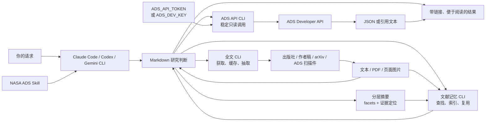

<h1 align="center">NASA ADS Skill</h1>

<div align="center">

**全文研究判断配合可复用的本地文献记忆**

在 Claude Code、Codex、Gemini CLI 或其他 Markdown skill 宿主中使用 NASA Astrophysics Data System。

[](https://ui.adsabs.harvard.edu/)
[](https://code.claude.com/docs/en/discover-plugins)
[](https://developers.openai.com/plugins/)
[](https://geminicli.com/docs/cli/gemini-md/)
[](plugins/nasa-ads/.codex-plugin/plugin.json)
[](LICENSE)
[](https://github.com/SukiYume/nasa-ads-skill)

[项目概览](#项目概览) ·
[Agent 一句话安装](#一句话交给-agent-安装) ·
[支持的宿主](#支持的宿主) ·
[安装](#安装) ·
[配置 token](#配置-ads-token) ·
[验证](#验证-api) ·
[开始使用](#开始使用) ·
[排错](#排错) ·
[English](README.md)

</div>

---

## 项目概览

NASA ADS Skill 把公开的 [NASA Astrophysics Data System Developer API](https://ui.adsabs.harvard.edu/help/api/) 封装成 Claude Code、Codex、Gemini CLI 和兼容 Markdown skill 宿主可复用的工作流。它可以检索天文和天体物理文献、获取并阅读合法可访问的论文全文、把论文中的多主题知识保存到可检索的本地数据库、按照精确文章版本与话题覆盖复用既有阅读、读取论文元数据、导出引用、管理 ADS libraries、汇总文献计量指标，以及寻找相关论文和数据链接。

宿主会从你的电脑直接访问 `https://api.adsabs.harvard.edu`。本仓库不保存 ADS token，也不运行中转服务。

README 是面向读者的使用指南：帮助你在全新电脑安装、配置 token、验证连接和排错。[`SKILL.md`](plugins/nasa-ads/skills/nasa-ads/SKILL.md) 是 agent 的运行契约，不再重复安装说明。

Skill 把研究判断保留在 agent 指令中，把可重复的机械步骤交给三个自带 Python CLI。它们分别负责稳定的 ADS API 调用，确定性的全文发现、下载、验证、缓存、抽取、扫描检测和页面渲染，以及带内容寻址对象存储和全文检索的版本感知 SQLite 文献库。核心路径只使用 Python 标准库；可选 PDF 工具用于改善抽取和渲染。ADS CLI 会拒绝携带认证信息的重定向，并把 ADS 错误响应判定为调用失败。

## 一句话交给 Agent 安装

如果电脑上已经运行着可以使用终端和网络的 agent，把下面这一句话复制给它即可。这是自然语言提示词，不是 shell 命令。

```text
请在这台电脑上从 https://github.com/SukiYume/nasa-ads-skill 安装当前 NASA ADS Skill：完整阅读仓库的 README 和 SKILL.md，识别你所在的 agent 宿主，按 README 中该宿主的说明安装缺少的前置条件和完整 skill；如已有 nasa-ads，只替换这一项；依次检查 ADS_API_TOKEN 和 ADS_DEV_KEY 但不要显示其值，如果两者都不存在就引导我按文档配置 token；确认 SKILL.md、scripts/ads_api.py、scripts/fulltext.py、scripts/literature_db.py、references/ads-cli.md、references/fulltext.md 和 references/literature-memory.md 均已安装，分别运行三个 CLI 的 --version，在凭据可用时运行 README 中的公开论文 API smoke test，再运行 arXiv 全文和文献记忆 smoke test，并报告安装路径、版本与验证结果。
```

## 支持的宿主

| 宿主 | 集成方式 | 安装后可用内容 |
|---|---|---|
| Claude Code | Marketplace plugin | 七个带命名空间的 slash commands，以及自然语言自动触发 |
| Codex CLI / 桌面应用 | Marketplace plugin | 带 UI 元数据的可安装 NASA ADS skill |
| Codex CLI / IDE 扩展 | 独立 skill | `$nasa-ads` 显式调用，以及匹配请求的自动触发 |
| Gemini CLI | `GEMINI.md` 导入 | 项目级或用户级 NASA ADS 指令 |
| 其他代理 | Markdown skill 目录 | 宿主支持复用指令和本地 shell 时加载共享 `SKILL.md` |

## 功能

| 能力 | 示例 |
|---|---|
| 文献检索 | 作者、标题、摘要、全文、bibcode、DOI、arXiv ID、ORCID、年份、期刊或目标名称 |
| 论断核查 | 使用多组检索表达式、通过摘要初筛、阅读全文材料并交代证据覆盖 |
| 全文阅读 | 开放发表版、作者稿、直接 arXiv HTML/PDF、ADS 扫描件、缓存、文本抽取和视觉回退 |
| 文献记忆 | 版本感知 SQLite 记录、已验证论文对象、多主题摘要、原子结论、证据定位、摘要历史，以及元数据/摘要/全文检索 |
| 元数据 | 标题、作者、摘要、年份、期刊、DOI、标识符、被引数和阅读数 |
| 引用导出 | BibTeX、带摘要 BibTeX、AASTeX、MNRAS、RIS、EndNote、IEEE、XML 等格式 |
| ADS 文库 | 列出、查看、创建、更新、分享、集合运算、清空和删除 libraries |
| 文献计量 | 基础统计、引用、h-index、g-index、i10-index、直方图和时间序列 |
| 关联发现 | 引用建议、similar/useful 论文、出版社、arXiv 和数据归档链接 |

Facet 根据每篇文章中可独立回答的研究问题与证据链动态生成。数据库不预设 FRB、系外行星、宇宙学、理论、模拟、星表或仪器专用字段。

## 工作原理



## 安装前准备

在全新电脑上先准备以下内容：

1. **Git**：从 [git-scm.com/downloads](https://git-scm.com/downloads) 安装。
2. **至少一个宿主**：
   - [Claude Code 安装文档](https://code.claude.com/docs/en/setup)
   - [Codex CLI 安装文档](https://developers.openai.com/codex/cli/)
   - [Gemini CLI 安装文档](https://geminicli.com/docs/get-started/installation/)
3. **ADS 账号和 API token**：稍后按[配置 ADS token](#配置-ads-token)完成。
4. **一种 API 传输方式**：推荐安装 [Python 3.10 或更新版本](https://www.python.org/downloads/)；三个自带 CLI 的核心路径都不需要第三方 Python 包。如果无法使用 Python，macOS/Linux/WSL 可用 `curl`，Windows 可用 PowerShell，进入条件式 ADS API 直接 HTTP 回退；持久文献记忆需要 Python 和 SQLite。
5. **可选 PDF 工具**：`pdftotext` 和 `pdfinfo` 可改善 PDF 文本处理，`pdftoppm` 可渲染扫描页。缺少这些工具时，具备相应能力的宿主仍可直接视觉阅读下载的 PDF 或页面图片。
6. **可访问外网 HTTPS**：需要连接 `api.adsabs.harvard.edu`、`arxiv.org` 和流程选中的合法出版社或仓储来源。

检查程序是否已经安装：

```bash
git --version
python3 --version   # macOS、Linux 或 WSL
python --version    # Windows；也可以使用 "py -3 --version"
claude --version   # 使用 Claude Code 时检查
codex --version    # 使用 Codex 时检查
gemini --version   # 使用 Gemini CLI 时检查
```

如果所选宿主命令不存在，请先按照上面的官方安装文档完成安装或升级。

## 安装

在下面选择一个宿主。Claude Code 和 Codex 可以直接把公开 GitHub 仓库加入 marketplace；独立 Skill 和 Gemini 安装会保留本地源码 clone，便于以后更新。

### Claude Code Plugin

Claude Code 安装完成后，以下命令可用于 macOS、Linux、Windows PowerShell 和 Windows Command Prompt。

1. 把 GitHub 仓库加入 Claude Code marketplace：

```bash
claude plugin marketplace add SukiYume/nasa-ads-skill
```

2. 从该 marketplace 安装 `nasa-ads`：

```bash
claude plugin install nasa-ads@nasa-ads-community
```

3. 检查安装结果：

```bash
claude plugin list
```

列表中应出现 `nasa-ads@nasa-ads-community`。

4. 启动 Claude Code：

```bash
claude
```

如果在现有会话期间完成安装，请运行 `/reload-plugins`。Plugin 提供以下命令：

```text
/nasa-ads:ads-search <query>
/nasa-ads:ads-bibtex <bibcodes>
/nasa-ads:ads-library [subcommand]
/nasa-ads:ads-metrics <bibcodes>
/nasa-ads:ads-cite [subcommand]
/nasa-ads:ads-fulltext <bibcodes, DOIs, or arXiv IDs>
/nasa-ads:ads-memory <lookup, search, show, stats, or paper topics>
```

接着完成[配置 ADS token](#配置-ads-token)，然后执行[验证 API](#验证-api)中的公开论文测试。

### Codex Plugin

Codex plugin 可用于 Codex CLI 和桌面应用中的 Codex。IDE 扩展请使用下一节的独立 skill。

1. 把 GitHub 仓库加入 Codex marketplace：

```bash
codex plugin marketplace add SukiYume/nasa-ads-skill
```

2. 安装 plugin：

```bash
codex plugin add nasa-ads@nasa-ads-community
```

3. 确认 Codex 已识别：

```bash
codex plugin list
```

4. 新建一个 Codex 会话，让安装后的 skill 进入新会话的 skill 列表：

```bash
codex
```

可以用 `$nasa-ads` 显式调用、通过 `/skills` 查看，也可以直接描述天文文献任务。

接着完成[配置 ADS token](#配置-ads-token)，然后执行[验证 API](#验证-api)中的公开论文测试。

### Codex 独立 Skill

Codex 目前从 `~/.agents/skills` 发现用户级独立 skills。Codex CLI 和 IDE 扩展都可使用此路径。

#### macOS、Linux 或 WSL

把源码 clone 保存在固定的用户级路径，再把 skill 内容复制到 Codex 的发现目录：

```bash
mkdir -p "$HOME/.local/share"
git clone --depth 1 \
  https://github.com/SukiYume/nasa-ads-skill.git \
  "$HOME/.local/share/nasa-ads-skill"
mkdir -p "$HOME/.agents/skills/nasa-ads"
cp -R \
  "$HOME/.local/share/nasa-ads-skill/plugins/nasa-ads/skills/nasa-ads/." \
  "$HOME/.agents/skills/nasa-ads/"
```

检查必需文件：

```bash
test -f "$HOME/.agents/skills/nasa-ads/SKILL.md" \
  && test -f "$HOME/.agents/skills/nasa-ads/scripts/ads_api.py" \
  && test -f "$HOME/.agents/skills/nasa-ads/scripts/fulltext.py" \
  && test -f "$HOME/.agents/skills/nasa-ads/scripts/literature_db.py" \
  && test -f "$HOME/.agents/skills/nasa-ads/references/fulltext.md" \
  && test -f "$HOME/.agents/skills/nasa-ads/references/literature-memory.md" \
  && test -f "$HOME/.agents/skills/nasa-ads/references/http-fallback.md" \
  && test -f "$HOME/.agents/skills/nasa-ads/references/libraries.md" \
  && echo "NASA ADS skill installed"
```

#### Windows PowerShell

把源码 clone 保存在固定的用户级路径，再把 skill 内容复制到 Codex 的发现目录：

```powershell
$nasaAdsSource = Join-Path $HOME 'nasa-ads-skill-source'
$nasaAdsSkill = Join-Path $HOME '.agents\skills\nasa-ads'
git clone --depth 1 `
  https://github.com/SukiYume/nasa-ads-skill.git `
  $nasaAdsSource
New-Item -ItemType Directory -Force $nasaAdsSkill | Out-Null
Copy-Item -Recurse -Force `
  (Join-Path $nasaAdsSource 'plugins\nasa-ads\skills\nasa-ads\*') `
  $nasaAdsSkill
```

检查必需文件：

```powershell
$nasaAdsSkillReady = `
  (Test-Path "$HOME\.agents\skills\nasa-ads\SKILL.md") -and `
  (Test-Path "$HOME\.agents\skills\nasa-ads\scripts\ads_api.py") -and `
  (Test-Path "$HOME\.agents\skills\nasa-ads\scripts\fulltext.py") -and `
  (Test-Path "$HOME\.agents\skills\nasa-ads\scripts\literature_db.py") -and `
  (Test-Path "$HOME\.agents\skills\nasa-ads\references\fulltext.md") -and `
  (Test-Path "$HOME\.agents\skills\nasa-ads\references\literature-memory.md") -and `
  (Test-Path "$HOME\.agents\skills\nasa-ads\references\http-fallback.md") -and `
  (Test-Path "$HOME\.agents\skills\nasa-ads\references\libraries.md")
$nasaAdsSkillReady
```

成功时会返回 `True`。

新建 Codex 会话，通过 `/skills` 查看列表，或在提示词中输入 `$nasa-ads`。

如果只想让当前仓库使用它，请把同一个 `nasa-ads` skill 目录复制到 `<repository>/.agents/skills/nasa-ads`。

### Gemini CLI

Gemini CLI 通过 `GEMINI.md` 加载指令文件。下面的用户级安装会让 NASA ADS 在所有 Gemini CLI 项目中可用。

#### macOS、Linux 或 WSL

```bash
mkdir -p "$HOME/.gemini"
git clone --depth 1 \
  https://github.com/SukiYume/nasa-ads-skill.git \
  "$HOME/.gemini/nasa-ads-skill"
printf '\n@./nasa-ads-skill/plugins/nasa-ads/skills/nasa-ads/SKILL.md\n' \
  >> "$HOME/.gemini/GEMINI.md"
```

#### Windows PowerShell

```powershell
New-Item -ItemType Directory -Force "$HOME\.gemini" | Out-Null
git clone --depth 1 `
  https://github.com/SukiYume/nasa-ads-skill.git `
  "$HOME\.gemini\nasa-ads-skill"
Add-Content -Path "$HOME\.gemini\GEMINI.md" -Value `
  "`n@./nasa-ads-skill/plugins/nasa-ads/skills/nasa-ads/SKILL.md"
```

启动 Gemini CLI：

```bash
gemini
```

然后运行：

```text
/memory reload
/memory show
```

确认已加载内容中包含 `NASA ADS` 标题。本仓库自己的 [`GEMINI.md`](GEMINI.md) 展示了同样的项目级相对导入格式。

### 通用 Markdown Skill 宿主

1. 克隆仓库：

```bash
git clone https://github.com/SukiYume/nasa-ads-skill.git
```

2. 把完整的 `plugins/nasa-ads/skills/nasa-ads/` 目录复制到宿主文档指定的 skill 或 prompt 目录。
3. 配置宿主加载其中的 `SKILL.md`。
4. 确认宿主可以用 Python 3 运行自带 CLI，或能通过 `curl`/PowerShell 使用直接 HTTP 回退。
5. 按下一节设置 ADS token。
6. 运行[验证 API](#验证-api)中的公开论文测试。

不同宿主使用的发现目录和调用语法可能不同。未采用上述 Claude Code、Codex 或 Gemini 约定时，请查阅该宿主的当前官方文档。

## 配置 ADS Token

每次调用 ADS Developer API 都需要个人 token。

1. 打开 [ADS token settings](https://ui.adsabs.harvard.edu/#user/settings/token)。
2. 注册 ADS 账号或登录已有账号。
3. 如果直达链接落在其他页面，请进入账号设置并选择 **API Token**。
4. 选择 **Generate a new key**。
5. 复制 token 并妥善保管。

建议使用 `ADS_API_TOKEN` 作为主要环境变量；`ADS_DEV_KEY` 可作为兼容回退。

### macOS、Linux 或 WSL

在当前终端设置 token：

```bash
export ADS_API_TOKEN='paste-your-token-here'
```

这个值会在终端关闭时失效。如果需要持久保存，可把同一行 `export` 加入当前 shell 的启动文件，常见文件包括 `~/.zshrc`、`~/.bashrc` 或 `~/.bash_profile`，然后打开新终端。

检查变量是否存在，同时避免打印 token：

```bash
if [ -n "${ADS_API_TOKEN:-${ADS_DEV_KEY:-}}" ]; then
  echo "ADS token is set"
else
  echo "ADS token is missing"
fi
```

### Windows PowerShell

在当前 PowerShell 会话中设置：

```powershell
$env:ADS_API_TOKEN = 'paste-your-token-here'
```

设置持久的用户环境变量：

```powershell
[Environment]::SetEnvironmentVariable(
  'ADS_API_TOKEN',
  'paste-your-token-here',
  'User'
)
```

执行持久设置后，请打开新终端并重启宿主。检查变量是否存在，同时避免打印 token：

```powershell
if ($env:ADS_API_TOKEN -or $env:ADS_DEV_KEY) {
  'ADS token is set'
} else {
  'ADS token is missing'
}
```

请勿把 token 放入仓库、截图、共享日志、shell 转录或支持请求。发现泄露时，请在 ADS 设置中撤销并重新生成。

## 验证 API

下面使用一篇公开论文验证网络、身份认证和 ADS 响应格式。

### 已安装的宿主

设置持久 token 后重启宿主。在 Claude Code 中运行：

```text
/nasa-ads:ads-search bibcode:2016PhRvL.116f1102A
```

在 Codex、Gemini CLI 或其他宿主中发送：

```text
在 NASA ADS 中检索 bibcode 2016PhRvL.116f1102A，返回标题、年份和 bibcode。
```

结果应识别出 *Observation of Gravitational Waves from a Binary Black Hole Merger*，并包含 `2016PhRvL.116f1102A`。如果提示缺少 token，说明宿主没有继承环境变量；如果返回 HTTP 错误，请按[排错](#排错)处理。

### 自带 Python CLI

Codex 独立 skill 和 Gemini 安装会在下面列出的路径中创建源码 checkout。先进入与你的安装方式对应的目录。

macOS、Linux 或 WSL：

```bash
cd "$HOME/.local/share/nasa-ads-skill"  # Codex 独立 skill
# Gemini CLI 则使用：
# cd "$HOME/.gemini/nasa-ads-skill"
```

然后运行：

```bash
python3 plugins/nasa-ads/skills/nasa-ads/scripts/ads_api.py search \
  --query 'bibcode:2016PhRvL.116f1102A' \
  --fields bibcode,title,year \
  --rows 1
```

Windows PowerShell：

```powershell
Set-Location "$HOME\nasa-ads-skill-source"  # Codex 独立 skill
# Gemini CLI 则使用：
# Set-Location "$HOME\.gemini\nasa-ads-skill"
```

然后运行：

```powershell
python plugins\nasa-ads\skills\nasa-ads\scripts\ads_api.py search `
  --query 'bibcode:2016PhRvL.116f1102A' `
  --fields 'bibcode,title,year' `
  --rows 1
```

如果 Python 注册为 `py` launcher，请把 `python` 换成 `py -3`。如果仓库 clone 在其他位置，请进入实际 checkout。JSON 响应中应包含 bibcode `2016PhRvL.116f1102A`。

### 全文 smoke test

这篇公开 arXiv 论文有官方 HTML 版本，因此 smoke test 不依赖 PDF 辅助工具。环境中没有 ADS token 时也可以运行。

macOS、Linux 或 WSL：

```bash
python3 plugins/nasa-ads/skills/nasa-ads/scripts/fulltext.py fetch \
  arXiv:1901.04502 \
  --source arxiv
```

Windows PowerShell：

```powershell
python plugins\nasa-ads\skills\nasa-ads\scripts\fulltext.py fetch `
  'arXiv:1901.04502' `
  --source arxiv
```

结果应报告 `status: fulltext`，选择 `https://arxiv.org/html/1901.04502`，并在用户缓存目录中给出确实存在的 `artifact_path`、`text_path` 和 `manifest_path`。官方 HTML 不可用时，脚本会自动尝试 `https://arxiv.org/pdf/<id>`。

在公式、图、表、页码或视觉阅读检查中明确需要 PDF 时，使用 `--format pdf`；`--format html` 只请求结构化 HTML。默认的 `--format auto` 保持 HTML 优先和自动回退流程。

### 文献记忆 smoke test

数据库 CLI 不需要 ADS token 就能验证 schema 和摘要契约。`template` 只输出 JSON，不会创建文献库。

macOS、Linux 或 WSL：

```bash
python3 plugins/nasa-ads/skills/nasa-ads/scripts/literature_db.py --version
python3 plugins/nasa-ads/skills/nasa-ads/scripts/literature_db.py template
```

Windows PowerShell：

```powershell
python plugins\nasa-ads\skills\nasa-ads\scripts\literature_db.py --version
python plugins\nasa-ads\skills\nasa-ads\scripts\literature_db.py template
```

两个平台上的 CLI 版本命令均应报告 `1.8.0`。模板应包含 `overview`、`facets`、`findings`、`global_limitations` 和 `reading`。第一次执行数据库操作时，会在 Windows 的 `%LOCALAPPDATA%\nasa-ads\literature` 或 macOS/Linux 的 `${XDG_DATA_HOME:-~/.local/share}/nasa-ads/literature` 创建文献库。可以通过 `NASA_ADS_LITERATURE_DIR` 选择其他位置。

### 直接 HTTP 回退

仅在 Python 3 无法运行自带 CLI，或所需端点尚未由 CLI 封装时使用。按 [`references/http-fallback.md`](plugins/nasa-ads/skills/nasa-ads/references/http-fallback.md) 中的凭据预检、重定向规则、响应检查和对应平台示例操作。

## 开始使用

所有受支持宿主都可以使用自然语言：

- “搜索 ADS 中近期关于系外行星大气的同行评议论文。”
- “查一下这个说法有没有天文文献提到，并给出检索词。”
- “获取 `2016PhRvL.116f1102A` 的 BibTeX。”
- “列出我的 ADS libraries。”
- “显示这些 bibcodes 的 citation metrics。”
- “查找与 `2016PhRvL.116f1102A` 相似的论文。”
- “获取并阅读 `2019MNRAS.489..176M` 的全文，然后总结方法、结果和局限性。”
- “在我的文献记忆中检索出现圆偏振符号反转的论文，并给出匹配结论和证据位置。”
- “查询数据库中的 `2023ApJ...955..142Z`，检查活动性、等待时间、能量分布和合成频谱是否已经覆盖。”
- “检索 2022 年以来关于快速射电暴重复暴的论文，并按主题总结。”
- “检查这个论断是否出现在已有研究中，说明检索范围和限制。”

Claude Code 命令示例：

```text
/nasa-ads:ads-search dark matter year:2020-2024
/nasa-ads:ads-bibtex 2016PhRvL.116f1102A 2017ApJ...848L..12A --format aastex
/nasa-ads:ads-library create "My Reading List"
/nasa-ads:ads-metrics 2016PhRvL.116f1102A
/nasa-ads:ads-cite links 2016PhRvL.116f1102A
/nasa-ads:ads-fulltext 2019MNRAS.489..176M arXiv:1602.03837
/nasa-ads:ads-memory lookup 2023ApJ...955..142Z waiting-time circular-polarization
```

文献调研结果应当带链接、便于阅读，说明检索范围，区分发表版、预印本、视觉阅读和摘要限定证据，并报告哪些论文得到复用、核验、补充、新入库或版本刷新。完整阅读会保存为多 facet 证据记录，后续问题可以检索相关内容，而不会把整篇论文压缩成一句话。

## 排错

| 现象 | 检查方法 |
|---|---|
| 找不到 `git`、`claude`、`codex` 或 `gemini` | 按[安装前准备](#安装前准备)中的官方链接安装或升级对应程序 |
| Claude marketplace 或 plugin 不见了 | 运行 `claude plugin marketplace update nasa-ads-community`，必要时重装，然后执行 `/reload-plugins` |
| Codex marketplace 或 plugin 不见了 | 运行 `codex plugin marketplace upgrade nasa-ads-community`，再运行 `codex plugin add nasa-ads@nasa-ads-community`，然后新建会话 |
| `/skills` 中没有 Codex 独立 skill | 确认 `~/.agents/skills/nasa-ads/SKILL.md` 存在，然后新建会话 |
| Gemini 没有加载指令 | 检查 `~/.gemini/GEMINI.md` 中的相对路径，再运行 `/memory reload` 和 `/memory show` |
| Python CLI 无法启动 | 安装 Python 3.10 或更新版本，依次尝试 `python3`、`python` 或 `py -3`，并确认完整 skill 目录中包含 `scripts/ads_api.py`、`scripts/fulltext.py` 和 `scripts/literature_db.py` |
| `401 Unauthorized` | 设置有效 token，打开新终端，并通过公开论文测试检查 `Bearer` header 路径 |
| `403 Forbidden` | 检查 ADS 账号权限和 library 权限 |
| `429 Too Many Requests` | 查看 `X-RateLimit-Remaining` 和 `X-RateLimit-Reset` 响应 header |
| API 返回意外重定向 | 停止调用并更新已安装 skill 或 endpoint；不要跟随带认证信息的重定向 |
| HTTP `200` 中包含 ADS 应用错误 | 将操作判定为失败，并报告返回的错误信息 |
| 检索不到论文 | 删除非必要过滤，尝试同义词和拼写变体，并记录检索范围 |
| 查询在 `&` 或空格处失效 | 使用会自动进行 URL 编码的自带 CLI；直接 HTTP 回退时需要编码 `q`、`fq` 和 `sort` |
| arXiv HTML 返回 `404` | 让 `fulltext.py` 继续尝试官方 `/pdf/<id>`；需要时安装 `pdftotext` 或使用宿主 PDF 视觉能力 |
| 全文状态为 `needs_visual_reading` | 用宿主 PDF 视觉工具打开选中的 PDF，或通过 `fulltext.py render --pages <range>` 分批渲染，每批不超过二十页 |
| 全文状态为 `abstract_only` | 检查候选错误，报告访问限制，并把科学结论限定在摘要级证据范围内 |
| 已存论文返回 `targeted_reading` | 请求的 facet 尚未覆盖；检索本地全文，完整阅读相关章节，再用 `--merge` 加入新 facet |
| 已存论文返回 `version_changed` | 比较刷新后 manifest 的正文内容指纹；科学正文变化时建立独立版本，仅 HTML/PDF 外壳变化时复用既有摘要 |
| 摘要检索找不到文章中的原句 | 使用 `literature_db.py search '<phrase>' --scope fulltext --mode phrase`；引用前对照存储的文章 |
| SQLite 不支持 FTS5 | 数据库 CLI 会自动使用确定性的大小写不敏感词项匹配；此时不能使用高级 `--mode fts` 查询 |
| 中文查询找不到已知 facet | 更新到 1.8.0 或更新版本；CJK 词项查询会自动使用子串匹配，并报告 `search_engine: substring` |

## 更新已有安装

Claude Code 或 Codex plugin 需要刷新 marketplace 和已经安装的 plugin：

```bash
claude plugin marketplace update nasa-ads-community
claude plugin update nasa-ads@nasa-ads-community
```

```bash
codex plugin marketplace upgrade nasa-ads-community
codex plugin add nasa-ads@nasa-ads-community
```

Codex 独立 skill 或 Gemini CLI import 需要更新安装时选择的源码路径。下面的命令沿用本 README 中的示例路径。

macOS、Linux 或 WSL 上的 Codex 独立 skill：

```bash
git -C "$HOME/.local/share/nasa-ads-skill" pull --ff-only
cp -R \
  "$HOME/.local/share/nasa-ads-skill/plugins/nasa-ads/skills/nasa-ads/." \
  "$HOME/.agents/skills/nasa-ads/"
```

Windows PowerShell 上的 Codex 独立 skill：

```powershell
$nasaAdsSource = Join-Path $HOME 'nasa-ads-skill-source'
$nasaAdsSkill = Join-Path $HOME '.agents\skills\nasa-ads'
git -C $nasaAdsSource pull --ff-only
Copy-Item -Recurse -Force `
  (Join-Path $nasaAdsSource 'plugins\nasa-ads\skills\nasa-ads\*') `
  $nasaAdsSkill
```

macOS、Linux 或 WSL 上的 Gemini CLI：

```bash
git -C "$HOME/.gemini/nasa-ads-skill" pull --ff-only
```

Windows PowerShell 上的 Gemini CLI：

```powershell
git -C "$HOME\.gemini\nasa-ads-skill" pull --ff-only
```

Gemini CLI 更新后运行 `/memory reload`。Codex 或 Claude Code 更新后新建宿主会话。

## 安全说明

- 安装前检查这个公开仓库。
- 把 `ADS_API_TOKEN` 和 `ADS_DEV_KEY` 放在版本控制之外。
- 不要跟随带认证信息的 ADS API 重定向。
- 向 arXiv、出版社、作者仓储或 Unpaywall 请求全文时不会携带 ADS authorization header。
- 全文文件会保存在用户缓存目录；受限稿件和共享电脑缓存应遵守用户所在环境的访问策略。
- 文献对象和摘要保留在用户数据目录中，不会上传到 ADS、arXiv、出版社或 embedding 服务。
- 数据库 CLI 不提供删除命令。手工删除、清空、迁移或移除历史前，应备份完整文献库并取得明确确认。
- 删除/清空 ADS library、替换/删除 library 备注、修改分享权限或转移所有权前进行确认。
- 把出版社和数据归档链接视为外部站点。
- ADS 的 rate limit 由各 endpoint 独立控制，响应 headers 是当前依据。

## 参考资料

- [ADS API 概览](https://ui.adsabs.harvard.edu/help/api/)
- [ADS OpenAPI 文档](https://ui.adsabs.harvard.edu/help/api/api-docs.html)
- [ADS Developer API 示例](https://github.com/adsabs/adsabs-dev-api)
- [Claude Code plugin 安装](https://code.claude.com/docs/en/discover-plugins)
- [OpenAI plugin 文档](https://developers.openai.com/plugins/)
- [Gemini CLI `GEMINI.md` 文档](https://geminicli.com/docs/cli/gemini-md/)

## License

[MIT](LICENSE)

---

<div align="center">

NASA ADS Skill · 从全新系统到首次验证成功的文献检索

</div>
