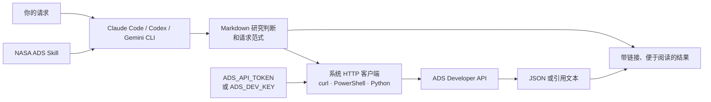

<h1 align="center">NASA ADS Skill — 纯 Markdown</h1>

<div align="center">

**完全由 Markdown 指令组成的可移植 NASA ADS 工作流**

在 Claude Code、Codex、Gemini CLI 或其他 Markdown skill 宿主中使用 NASA Astrophysics Data System。

[](https://ui.adsabs.harvard.edu/)
[](https://code.claude.com/docs/en/discover-plugins)
[](https://developers.openai.com/plugins/)
[](https://geminicli.com/docs/cli/gemini-md/)
[](plugins/nasa-ads/.codex-plugin/plugin.json)
[](LICENSE)
[](https://github.com/SukiYume/nasa-ads-skill)

[项目概览](#项目概览) ·
[支持的宿主](#支持的宿主) ·
[安装](#安装) ·
[配置 token](#配置-ads-token) ·
[验证](#验证-api) ·
[开始使用](#开始使用) ·
[排错](#排错) ·
[English](README.md)

</div>

---

## 项目概览

NASA ADS Skill 把公开的 [NASA Astrophysics Data System Developer API](https://ui.adsabs.harvard.edu/help/api/) 封装成可复用工作流，可用于 Claude Code、Codex、Gemini CLI 和兼容 Markdown skill 的宿主。它可以检索天文和天体物理文献、读取论文元数据、导出引用、管理 ADS libraries、汇总文献计量指标，以及寻找相关论文和全文/数据链接。

宿主会从你的电脑直接访问 `https://api.adsabs.harvard.edu`。本仓库不保存 ADS token，也不运行中转服务。

README 面向读者：说明如何在全新电脑上安装、配置 token、验证连接和排错。[`SKILL.md`](plugins/nasa-ads/skills/nasa-ads/SKILL.md) 是 agent 的运行契约，不重复面向人的安装说明。

Markdown 同时保存研究流程和直接 HTTPS 请求范式。Agent 使用电脑上已有的 HTTP 客户端；本项目不附带可执行程序或 Python 包。

## 支持的宿主

| 宿主 | 集成方式 | 安装后可用内容 |
|---|---|---|
| Claude Code | Marketplace plugin | 五个带命名空间的 slash commands，以及自然语言自动触发 |
| Codex CLI / 桌面应用 | Marketplace plugin | 带 UI 元数据的可安装 NASA ADS skill |
| Codex CLI / IDE 扩展 | 独立 skill | `$nasa-ads` 显式调用，以及匹配请求的自动触发 |
| Gemini CLI | `GEMINI.md` 导入 | 项目级或用户级 NASA ADS 指令 |
| 其他代理 | Markdown skill 目录 | 宿主支持复用指令和本地 shell 时加载共享 `SKILL.md` |

## 功能

| 能力 | 示例 |
|---|---|
| 文献检索 | 作者、标题、摘要、全文、bibcode、DOI、arXiv ID、ORCID、年份、期刊或目标名称 |
| 论断核查 | 使用多组检索表达式、阅读摘要、交代检索范围 |
| 元数据 | 标题、作者、摘要、年份、期刊、DOI、标识符、被引数和阅读数 |
| 引用导出 | BibTeX、带摘要 BibTeX、AASTeX、MNRAS、RIS、EndNote、IEEE、XML 等格式 |
| ADS 文库 | 列出、查看、创建、更新、添加备注、分享、转移所有权、集合运算、清空和删除 libraries |
| 文献计量 | 基础统计、引用、h-index、g-index、i10-index、直方图和时间序列 |
| 关联发现 | 引用建议、similar/useful 论文、出版社、arXiv 和数据归档链接 |

## 工作原理



## 安装前准备

在全新电脑上先准备以下内容：

1. **Git**：从 [git-scm.com/downloads](https://git-scm.com/downloads) 安装。
2. **至少一个宿主**：
   - [Claude Code 安装文档](https://code.claude.com/docs/en/setup)
   - [Codex CLI 安装文档](https://developers.openai.com/codex/cli/)
   - [Gemini CLI 安装文档](https://geminicli.com/docs/get-started/installation/)
3. **ADS 账号和 API token**：稍后按[配置 ADS token](#配置-ads-token)完成。
4. **HTTP 客户端**：macOS/Linux/WSL 使用 `curl`，Windows PowerShell 使用 `Invoke-RestMethod`。如果 `curl --version` 不可用，请通过操作系统的软件包管理器安装 `curl`。
5. **可访问外网 HTTPS**：需要连接 `api.adsabs.harvard.edu`。

检查程序是否已经安装：

```bash
git --version
claude --version   # 使用 Claude Code 时检查
codex --version    # 使用 Codex 时检查
gemini --version   # 使用 Gemini CLI 时检查
```

如果所选宿主命令不存在，请先按照上面的官方安装文档完成安装或升级。

## 安装

在下面选择一个宿主。Claude Code 和 Codex 优先使用 plugin 安装；Codex IDE 扩展和其他本地 skill 场景可以使用独立安装。

### Claude Code Plugin

Claude Code 安装完成后，以下命令可用于 macOS、Linux、Windows PowerShell 和 Windows Command Prompt。

1. 把本 GitHub 仓库加入 Claude Code marketplace：

```bash
claude plugin marketplace add SukiYume/nasa-ads-skill@mdonly
```

2. 从该 marketplace 安装 `nasa-ads`：

```bash
claude plugin install nasa-ads@nasa-ads-community
```

3. 检查安装结果：

```bash
claude plugin list
```

列表中应出现 `nasa-ads@nasa-ads-community`。

4. 启动 Claude Code：

```bash
claude
```

如果在现有会话期间完成安装，请运行 `/reload-plugins`。Plugin 提供以下命令：

```text
/nasa-ads:ads-search <query>
/nasa-ads:ads-bibtex <bibcodes>
/nasa-ads:ads-library [subcommand]
/nasa-ads:ads-metrics <bibcodes>
/nasa-ads:ads-cite [subcommand]
```

接着完成[配置 ADS token](#配置-ads-token)，然后执行[开始使用](#开始使用)中的首次检索。

### Codex Plugin

Codex plugin 可用于 Codex CLI 和桌面应用中的 Codex。IDE 扩展请使用下一节的独立 skill。

1. 把本仓库加入 Codex marketplace：

```bash
codex plugin marketplace add SukiYume/nasa-ads-skill --ref mdonly
```

2. 安装 plugin：

```bash
codex plugin add nasa-ads@nasa-ads-community
```

3. 确认 Codex 已识别：

```bash
codex plugin list
```

4. 新建一个 Codex 会话，让安装后的 skill 进入新会话的 skill 列表：

```bash
codex
```

可以用 `$nasa-ads` 显式调用、通过 `/skills` 查看，也可以直接描述天文文献任务。

接着完成[配置 ADS token](#配置-ads-token)。

### Codex 独立 Skill

Codex 目前从 `~/.agents/skills` 发现用户级独立 skills。Codex CLI 和 IDE 扩展都可使用此路径。

#### macOS、Linux 或 WSL

把源码 clone 保存在固定的用户级路径，再把 skill 内容复制到 Codex 的发现目录：

```bash
mkdir -p "$HOME/.local/share"
git clone --depth 1 --branch mdonly --single-branch \
  https://github.com/SukiYume/nasa-ads-skill.git \
  "$HOME/.local/share/nasa-ads-mdonly"
mkdir -p "$HOME/.agents/skills/nasa-ads"
cp -R \
  "$HOME/.local/share/nasa-ads-mdonly/plugins/nasa-ads/skills/nasa-ads/." \
  "$HOME/.agents/skills/nasa-ads/"
```

检查必需文件：

```bash
test -f "$HOME/.agents/skills/nasa-ads/SKILL.md" \
  && echo "NASA ADS skill installed"
```

#### Windows PowerShell

把源码 clone 保存在固定的用户级路径，再把 skill 内容复制到 Codex 的发现目录：

```powershell
$nasaAdsSource = Join-Path $HOME 'nasa-ads-mdonly-source'
$nasaAdsSkill = Join-Path $HOME '.agents\skills\nasa-ads'
git clone --depth 1 --branch mdonly --single-branch `
  https://github.com/SukiYume/nasa-ads-skill.git `
  $nasaAdsSource
New-Item -ItemType Directory -Force $nasaAdsSkill | Out-Null
Copy-Item -Recurse -Force `
  (Join-Path $nasaAdsSource 'plugins\nasa-ads\skills\nasa-ads\*') `
  $nasaAdsSkill
```

检查必需文件：

```powershell
Test-Path "$HOME\.agents\skills\nasa-ads\SKILL.md"
```

成功时会返回 `True`。

新建 Codex 会话，通过 `/skills` 查看列表，或在提示词中输入 `$nasa-ads`。

如果只想让当前仓库使用它，请把同一个 `nasa-ads` skill 目录复制到 `<repository>/.agents/skills/nasa-ads`。

### Gemini CLI

Gemini CLI 通过 `GEMINI.md` 加载指令文件。下面的用户级安装会让 NASA ADS 在所有 Gemini CLI 项目中可用。

#### macOS、Linux 或 WSL

```bash
mkdir -p "$HOME/.gemini"
git clone --depth 1 --branch mdonly --single-branch \
  https://github.com/SukiYume/nasa-ads-skill.git \
  "$HOME/.gemini/nasa-ads-mdonly"
printf '\n@./nasa-ads-mdonly/plugins/nasa-ads/skills/nasa-ads/SKILL.md\n' \
  >> "$HOME/.gemini/GEMINI.md"
```

#### Windows PowerShell

```powershell
New-Item -ItemType Directory -Force "$HOME\.gemini" | Out-Null
git clone --depth 1 --branch mdonly --single-branch `
  https://github.com/SukiYume/nasa-ads-skill.git `
  "$HOME\.gemini\nasa-ads-mdonly"
Add-Content -Path "$HOME\.gemini\GEMINI.md" -Value `
  "`n@./nasa-ads-mdonly/plugins/nasa-ads/skills/nasa-ads/SKILL.md"
```

启动 Gemini CLI：

```bash
gemini
```

然后运行：

```text
/memory reload
/memory show
```

确认已加载内容中包含 `NASA ADS` 标题。本仓库自己的 [`GEMINI.md`](GEMINI.md) 展示了同样的项目级相对导入格式。

### 通用 Markdown Skill 宿主

1. 克隆仓库：

```bash
git clone --depth 1 --branch mdonly --single-branch https://github.com/SukiYume/nasa-ads-skill.git
```

2. 把完整的 `plugins/nasa-ads/skills/nasa-ads/` 目录复制到宿主文档指定的 skill 或 prompt 目录。
3. 配置宿主加载其中的 `SKILL.md`。
4. 确认宿主可以通过 `curl`、PowerShell 或 Python 发起 HTTPS 请求。
5. 按下一节设置 ADS token。
6. 运行[验证 API](#验证-api)中的公开论文测试。

不同宿主使用的发现目录和调用语法可能不同。未采用上述 Claude Code、Codex 或 Gemini 约定时，请查阅该宿主的当前官方文档。

## 配置 ADS Token

每次调用 ADS Developer API 都需要个人 token。

1. 打开 [ADS token settings](https://ui.adsabs.harvard.edu/#user/settings/token)。
2. 注册 ADS 账号或登录已有账号。
3. 如果直达链接落在其他页面，请进入账号设置并选择 **API Token**。
4. 选择 **Generate a new key**。
5. 复制 token 并妥善保管。

建议使用 `ADS_API_TOKEN` 作为主要环境变量；`ADS_DEV_KEY` 可作为兼容回退。

### macOS、Linux 或 WSL

在当前终端设置 token：

```bash
export ADS_API_TOKEN='paste-your-token-here'
```

这个值会在终端关闭时失效。如果需要持久保存，可把同一行 `export` 加入当前 shell 的启动文件，常见文件包括 `~/.zshrc`、`~/.bashrc` 或 `~/.bash_profile`，然后打开新终端。

检查变量是否存在，同时避免打印 token：

```bash
if [ -n "${ADS_API_TOKEN:-${ADS_DEV_KEY:-}}" ]; then
  echo "ADS token is set"
else
  echo "ADS token is missing"
fi
```

### Windows PowerShell

在当前 PowerShell 会话中设置：

```powershell
$env:ADS_API_TOKEN = 'paste-your-token-here'
```

设置持久的用户环境变量：

```powershell
[Environment]::SetEnvironmentVariable(
  'ADS_API_TOKEN',
  'paste-your-token-here',
  'User'
)
```

执行持久设置后，请打开新终端并重启宿主。检查变量是否存在，同时避免打印 token：

```powershell
if ($env:ADS_API_TOKEN -or $env:ADS_DEV_KEY) {
  'ADS token is set'
} else {
  'ADS token is missing'
}
```

请勿把 token 放入仓库、截图、共享日志、shell 转录或支持请求。发现泄露时，请在 ADS 设置中撤销并重新生成。

## 验证 API

下面使用一篇公开论文验证网络、身份认证和 ADS 响应格式。

### curl

```bash
NASA_ADS_TOKEN="${ADS_API_TOKEN:-${ADS_DEV_KEY:-}}"
curl -fsSG 'https://api.adsabs.harvard.edu/v1/search/query' \
  -H "Authorization: Bearer $NASA_ADS_TOKEN" \
  --data-urlencode 'q=bibcode:2016PhRvL.116f1102A' \
  --data-urlencode 'fl=bibcode,title,year' \
  --data-urlencode 'rows=1'
```

JSON 响应中应包含 bibcode `2016PhRvL.116f1102A`。不要添加 `-L` 或 `--location`；带身份认证信息的 ADS 请求不得跟随重定向。

### Windows PowerShell

```powershell
$nasaAdsToken = if ($env:ADS_API_TOKEN) {
  $env:ADS_API_TOKEN
} else {
  $env:ADS_DEV_KEY
}
$nasaAdsQuery = [uri]::EscapeDataString(
  'bibcode:2016PhRvL.116f1102A'
)
$nasaAdsUri = "https://api.adsabs.harvard.edu/v1/search/query" +
  "?q=$nasaAdsQuery&fl=bibcode,title,year&rows=1"

Invoke-RestMethod `
  -Method Get `
  -Uri $nasaAdsUri `
  -Headers @{ Authorization = "Bearer $nasaAdsToken" } `
  -MaximumRedirection 0
```

响应中的 `response.docs[0].bibcode` 应等于 `2016PhRvL.116f1102A`。

## 开始使用

所有受支持宿主都可以使用自然语言：

- “搜索 ADS 中近期关于系外行星大气的同行评议论文。”
- “查一下这个说法有没有天文文献提到，并给出检索词。”
- “获取 `2016PhRvL.116f1102A` 的 BibTeX。”
- “列出我的 ADS libraries。”
- “显示这些 bibcodes 的 citation metrics。”
- “查找与 `2016PhRvL.116f1102A` 相似的论文。”
- “检索 2022 年以来关于快速射电暴重复暴的论文，并按主题总结。”
- “检查这个论断是否出现在已有研究中，说明检索范围和限制。”

Claude Code 命令示例：

```text
/nasa-ads:ads-search dark matter year:2020-2024
/nasa-ads:ads-bibtex 2016PhRvL.116f1102A 2017ApJ...848L..12A --format aastex
/nasa-ads:ads-library create "My Reading List"
/nasa-ads:ads-metrics 2016PhRvL.116f1102A
/nasa-ads:ads-cite links 2016PhRvL.116f1102A
```

Skill 会要求代理返回带链接、便于阅读的结果，扩展检索表达式，并按实际查询范围描述空结果。

## 排错

| 现象 | 检查方法 |
|---|---|
| 找不到 `git`、`claude`、`codex` 或 `gemini` | 按[安装前准备](#安装前准备)中的官方链接安装或升级对应程序 |
| Claude marketplace 或 plugin 不见了 | 运行 `claude plugin marketplace update nasa-ads-community`，必要时重装，然后执行 `/reload-plugins` |
| Codex marketplace 或 plugin 不见了 | 运行 `codex plugin marketplace upgrade nasa-ads-community`，再运行 `codex plugin add nasa-ads@nasa-ads-community`，然后新建会话 |
| `/skills` 中没有 Codex 独立 skill | 确认 `~/.agents/skills/nasa-ads/SKILL.md` 存在，然后新建会话 |
| Gemini 没有加载指令 | 检查 `~/.gemini/GEMINI.md` 中的相对路径，再运行 `/memory reload` 和 `/memory show` |
| `401 Unauthorized` | 设置有效 token，打开新终端，并通过公开论文测试检查 `Bearer` header 路径 |
| `403 Forbidden` | 检查 ADS 账号权限和 library 权限 |
| `429 Too Many Requests` | 查看 `X-RateLimit-Remaining` 和 `X-RateLimit-Reset` 响应 header |
| API 返回意外重定向 | 停止调用并检查配置的 endpoint；不要跟随带身份认证信息的重定向 |
| HTTP `200` 中包含 ADS 应用错误 | 将操作判定为失败，并报告返回的 `Error` 或 `error` 信息 |
| 检索不到论文 | 删除非必要过滤，尝试同义词和拼写变体，并记录检索范围 |
| ADS 报告查询字段未定义 | 把 `object:` 等不支持的字段换成文档支持的 `title:`、`abs:` 或 `full:` |
| 查询在 `&` 或空格处失效 | 对 `q`、`fq` 和 `sort` 做 URL 编码；`curl` 示例使用 `--data-urlencode` |

## 更新已有安装

如果添加 marketplace 时没有固定分支，请按下面的命令重新安装一次，确保后续更新始终使用这个纯 Markdown 项目：

```bash
claude plugin uninstall nasa-ads@nasa-ads-community
claude plugin marketplace remove nasa-ads-community
claude plugin marketplace add SukiYume/nasa-ads-skill@mdonly
claude plugin install nasa-ads@nasa-ads-community
```

```bash
codex plugin remove nasa-ads@nasa-ads-community
codex plugin marketplace remove nasa-ads-community
codex plugin marketplace add SukiYume/nasa-ads-skill --ref mdonly
codex plugin add nasa-ads@nasa-ads-community
```

完成一次分支固定后，正常更新 marketplace 和已安装的 plugin：

```bash
claude plugin marketplace update nasa-ads-community
claude plugin update nasa-ads@nasa-ads-community
```

```bash
codex plugin marketplace upgrade nasa-ads-community
codex plugin add nasa-ads@nasa-ads-community
```

如果独立安装来自较早的未固定分支 clone，请先按对应的安装章节重新安装一次。固定分支后的源码目录使用其中所示的 `nasa-ads-mdonly` 名称。

macOS、Linux 或 WSL 上的 Codex 独立 skill：

```bash
git -C "$HOME/.local/share/nasa-ads-mdonly" pull --ff-only
cp -R \
  "$HOME/.local/share/nasa-ads-mdonly/plugins/nasa-ads/skills/nasa-ads/." \
  "$HOME/.agents/skills/nasa-ads/"
```

Windows PowerShell 上的 Codex 独立 skill：

```powershell
$nasaAdsSource = Join-Path $HOME 'nasa-ads-mdonly-source'
$nasaAdsSkill = Join-Path $HOME '.agents\skills\nasa-ads'
git -C $nasaAdsSource pull --ff-only
Copy-Item -Recurse -Force `
  (Join-Path $nasaAdsSource 'plugins\nasa-ads\skills\nasa-ads\*') `
  $nasaAdsSkill
```

macOS、Linux 或 WSL 上的 Gemini CLI：

```bash
git -C "$HOME/.gemini/nasa-ads-mdonly" pull --ff-only
```

Windows PowerShell 上的 Gemini CLI：

```powershell
git -C "$HOME\.gemini\nasa-ads-mdonly" pull --ff-only
```

Gemini CLI 更新后运行 `/memory reload`。Codex 或 Claude Code 更新后新建宿主会话。

## 安全说明

- 安装前检查这个公开仓库。
- 把 `ADS_API_TOKEN` 和 `ADS_DEV_KEY` 放在版本控制之外。
- 带身份认证信息的 ADS API 请求不得跟随重定向。
- 即使 HTTP 状态是 `200`，顶层含 `Error` 或 `error` 的响应也应判定为失败。
- 删除/清空 ADS library、替换/删除备注、修改分享权限或转移所有权前进行确认。
- 把出版社和数据归档链接视为外部站点。
- ADS 的 rate limit 由各 endpoint 独立控制，响应 headers 是当前依据。

## 参考资料

- [ADS API 概览](https://ui.adsabs.harvard.edu/help/api/)
- [ADS OpenAPI 文档](https://ui.adsabs.harvard.edu/help/api/api-docs.html)
- [ADS Developer API 示例](https://github.com/adsabs/adsabs-dev-api)
- [Claude Code plugin 安装](https://code.claude.com/docs/en/discover-plugins)
- [OpenAI plugin 文档](https://developers.openai.com/plugins/)
- [Gemini CLI `GEMINI.md` 文档](https://geminicli.com/docs/cli/gemini-md/)

## License

[MIT](LICENSE)

---

<div align="center">

NASA ADS Skill · 纯 Markdown 工作流 · 从全新系统到首次验证成功的文献检索

</div>
