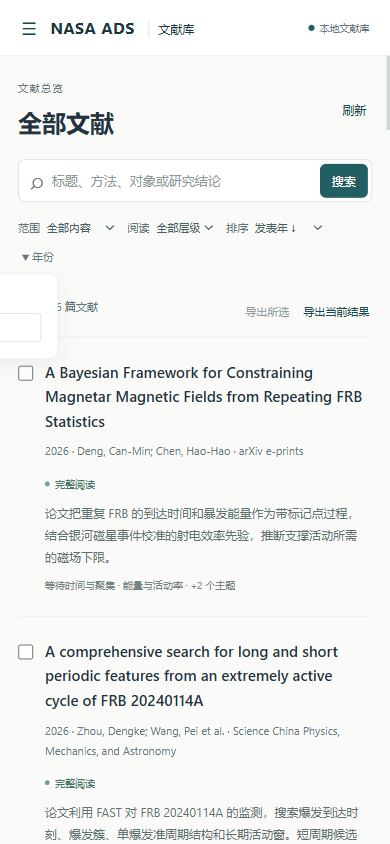
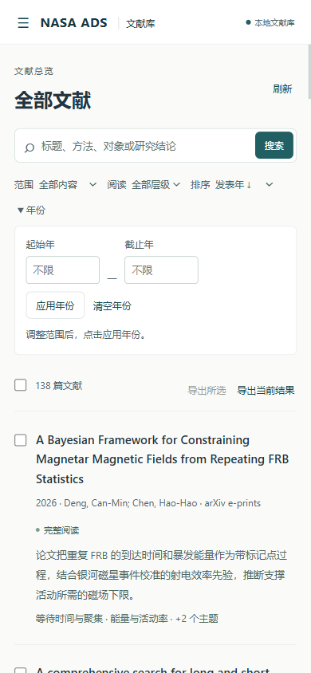
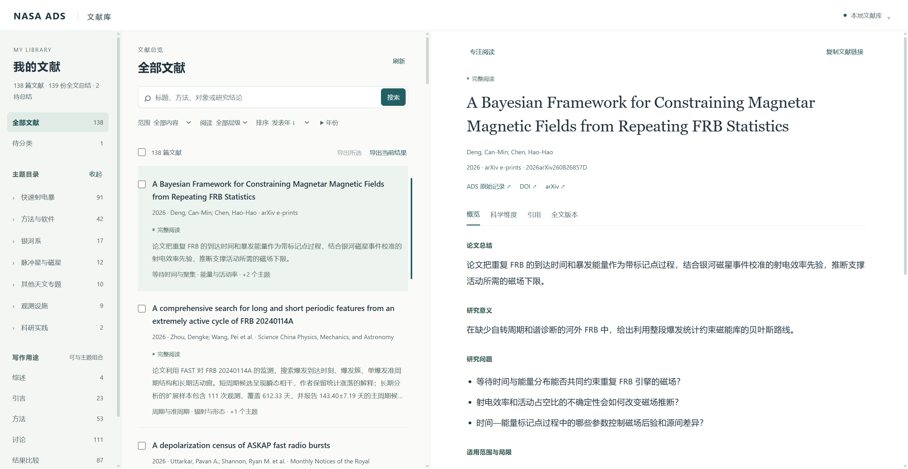

# Chrome Web audit and fixes

Audit date: 2026-09-05 UTC. Release: 1.13.2. This phase follows the [personal library upgrade](library-upgrade.md). It covers finding a paper, reading its evidence, exporting citations and article files, and recovering the same context later.

## Scope and evidence

The audit used actual Chrome interactions through Chrome DevTools, current-run screenshots, downloaded files, browser history, keyboard input, network emulation, and Lighthouse snapshots. The server read the personal library at `%LOCALAPPDATA%/nasa-ads/literature`. The initial capture contained 136 papers and 139 full-text summaries. A later live refresh contained 138 papers, 139 full-text summaries, two pending summaries, and one unclassified paper. The Web audit used read-only library access throughout.

Desktop captures used a viewport of approximately 1757 × 908 CSS pixels. Mobile testing used Chrome emulation at 390 × 844 CSS pixels. The existing topic hierarchy, writing roles, evidence labels, scientific facets, and local citation provenance provide a useful research workflow. The changes preserve the three-pane desktop layout and the mobile navigation drawer.

## Findings and disposition

| ID | Flow step | Observed issue | Implemented improvement | State |
| --- | --- | --- | --- | --- |
| W1 | 2. Filter by years | At 390 px, the year popup started at x = −158 px and clipped most inputs outside the viewport. | The year form expands within the list column, wraps its actions, and remains inside the viewport. The verified panel spans approximately x = 18–372 px. | Resolved |
| W2 | 2. Filter by years | A reversed range sent an invalid request and displayed a temporary English error beside stale results. Applied years were absent from the filter chips. | Validate integer years and range order before a request, show persistent Chinese feedback, preserve previous results, and display removable applied-year chips. Reading level and scoped search also have visible chips. | Resolved |
| W3 | 3. Revisit a paper | Reloading kept the paper hash while dropping topic, role, years, and the active detail tab. Paper navigation replaced history entries. | Serialize browsing context in the URL, restore it on reload and history navigation, and preserve it in copied article links. Cancel pending restoration after a newer user action. | Resolved |
| W4 | 1 and 4. Scan and read | Auxiliary descriptions, topic counts, and reading hints had low contrast. List and reading text was small. | Darken auxiliary text and counts, increase list metadata and summary sizes, and use 16 px desktop / 15 px mobile reading text. | Resolved |
| W5 | 7. Recover a connection | Failed loading depended on a temporary notice. | Keep a visible connection or list-loading message, preserve previously loaded rows, and disable whole-view export until recovery. Refresh restores the live state. | Resolved |
| W6 | 1. Open the library | Chrome requested a missing favicon; page metadata lacked a description. | Add a local empty favicon and a useful page description. | Resolved |

## Tested journey

| Step | User operation and evidence | Health after fixes |
| --- | --- | --- |
| 1 | Open the actual personal library, inspect its storage information, and browse nested topics. Counts reflected the live database. | Healthy |
| 2 | Select `快速射电暴/爆发统计/周期与准周期` (17 papers), combine `methods` (3 papers), reject 2025–2020, and apply 2020–2026. Invalid input generated no paper request. | Healthy |
| 3 | Open paper 72, switch to citations, reload, go back to the filtered list, and go forward to the same paper and citation tab. The topic, role, years, and 3-paper count were retained. Reloading page two retained `31–60 / 138`. | Healthy |
| 4 | Read the overview, expand all six scientific facets and 16 findings, switch detail tabs with arrow keys, and inspect exact stored versions. | Healthy |
| 5 | Download the whole filtered bibliography and a single checked paper. The downloads contained exactly 3 and 1 expected citation keys. Download the HTML article and extracted text for version 73. | Healthy |
| 6 | Search `准周期` in authored summaries (8 results); search a nonexistent term (0 results with guidance and disabled export); clear filters; page and sort by ascending publication year (first year 1983). Test the 390 px year form, navigation drawer, reader return action, and library dialog. `/` respects the open modal; Escape returns focus to its trigger. | Healthy |
| 7 | Emulate an offline connection, click refresh, inspect the persistent failure message and disabled export, then restore the connection and refresh successfully. | Healthy |

The filtered bibliography contained `2024ApJ...977..129D`, `2022RAA....22l4004N`, and `2021PhRvD.104b3007D`. The selected bibliography contained only `2024ApJ...977..129D`. Chrome downloaded 2956-byte and 942-byte BibTeX files, a 324672-byte HTML article, and 73637 bytes of extracted text.

## Visual verification

The mobile year form before and after the fix:

The revised desktop reader:

## Accessibility and verification limits

The initial desktop Lighthouse snapshot scored 96 for accessibility. Low-contrast text was the failing audit. The final desktop snapshot scored 100 for accessibility, best practices, SEO, and agentic browsing, with zero failed automated audits. These scores cover the captured page state. Keyboard checks covered selected core interactions. Mobile checks used Chrome emulation. Physical phones, other browser engines, screen readers, and an exhaustive WCAG conformance assessment remain outside this run's verification scope.

## Release validation

All 165 unit tests passed, including README relative-link checks and release/resource consistency. JavaScript syntax, Python compilation, Ruff, the UTF-8 Codex skill validator, strict Claude manifest validation, and whitespace checks passed. The current changes to scripts consist of the synchronized release version; Web behavior is implemented in the bundled assets. The library audit reported healthy integrity, verified stored hashes, and zero errors or warnings.

The Codex standalone installation at `~/.agents/skills/nasa-ads` and Claude standalone installation at `~/.claude/skills/nasa-ads` each match all 17 packaged skill files. Their three CLI entrypoints report 1.13.2. The pre-update copies remain under `%LOCALAPPDATA%/nasa-ads/backups/skills-before-1.13.2-20260905T085819`. The pending-summary completion check reports the live unfinished records separately from installation and database integrity.

The audit evidence is retained locally under `.validation/web-audit-20260905/`, including original screenshots, before/after Lighthouse JSON, downloaded bibliographies, server logs, validation output, and installed-file verification. The installed Codex copy serves the final local Web interface at port 8765.
